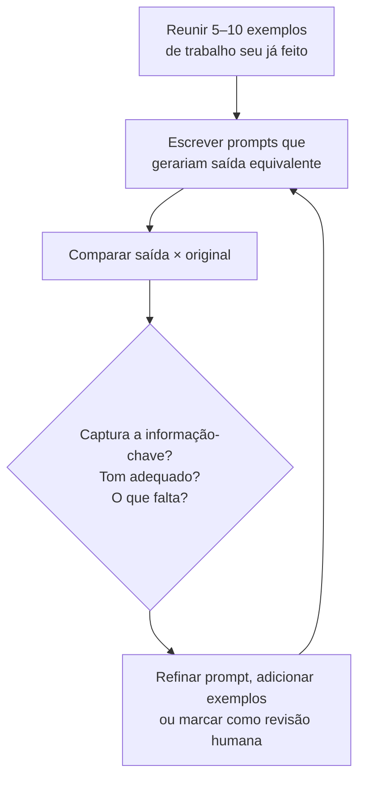

> [!abstract]
> Um **eval** é um teste sistemático de quão bem um sistema de IA desempenha um tipo específico de tarefa — a forma de substituir a impressão ("pareceu bom") por evidência sobre onde ele serve e onde não serve.

## Conceito

Benchmarks públicos dizem quão bom um modelo é **em média, em tarefas genéricas**. Não dizem nada sobre se ele serve para *a sua* documentação técnica, no *seu* domínio, com o *seu* padrão de qualidade.

O eval fecha essa lacuna. Ele não precisa de infraestrutura: no formato leve, é comparar a saída do modelo com trabalho que você já fez e sabe julgar. O valor não é uma nota — é **desenvolver intuição** sobre onde a IA agrega mais, onde precisa de mais contexto, e onde a revisão humana é inegociável.

## Para que serve

- Entender onde a IA agrega mais valor no seu fluxo
- Identificar tarefas em que é preciso fornecer mais contexto ou exemplos
- Construir confiança calibrada em saídas de tarefas recorrentes
- Localizar onde a revisão humana continua obrigatória

## Anatomia

## Características

- **Ancorado em trabalho real** — o gabarito é o que você já produziu e sabe defender
- **Comparativo, não absoluto** — não existe nota isolada; existe "melhor ou pior que o meu"
- **Barato** — dez exemplos e uma tarde bastam para o formato leve
- **Repetível** — o mesmo conjunto reavalia quando o modelo, o prompt ou a [[Agent Skill|skill]] mudam
- **Diagnóstico** — o valor está em *onde* falhou, não em *quanto* acertou

> [!tip] O padrão de falha é mais informativo que a taxa de acerto
> "O modelo acerta os números mas perde o padrão geral" é acionável — vira uma instrução de prompt ou uma seção de skill. "72% de acerto" não é.

## Comparação

| | Eval leve | Benchmark público | Impressão de uso |
|---|---|---|---|
| Representa | Seu trabalho real | Tarefas genéricas | Memória seletiva |
| Custo | Baixo | Alto | Zero |
| Acionável | Sim, diretamente | Só para escolher modelo | Não |

## Relação com fluência

Eval é a competência **Discernment** de [[AI Fluency]] instrumentada. Sem eval, o discernimento fica na anedota; com eval, vira prática. Ver [[Eval Leve de Tarefas com IA]].

## Veja também

- [[AI Fluency]]
- [[Human-in-the-Loop]]
- [[Service Validation and Testing]]
- [[Agent Skill]]
