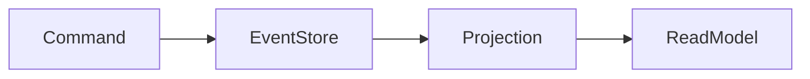

Event Sourcing é um padrão onde o estado da aplicação é reconstruído a partir da sequência de eventos ocorridos.

Em vez de armazenar apenas o estado atual, armazenam-se todos os eventos.

> [!info]
> O histórico completo da aplicação fica preservado.

O event store é um log **append-only** cujos eventos precisam ser sequenciados com números incrementais para garantir a ordem. A projeção pode cair e ser reconstruída a qualquer momento — o log continua sendo a fonte da verdade. Na prática, é o mesmo modelo de retenção de uma [[Event Streaming Platform]], que costuma ser a infraestrutura escolhida para sustentá-lo.

## Benefícios

- Auditoria
- Replay
- Rastreabilidade
- Integração por eventos

## Desafios

- Complexidade
- Evolução de eventos
- Projeções

## Veja também

- [[Event Streaming Platform]]
- [[Message Queue]]
- [[Microservices]]
- [[System Design MOC]]
- [[CQRS]]
- [[Event Driven Architecture]]
- [[Domain Events]]