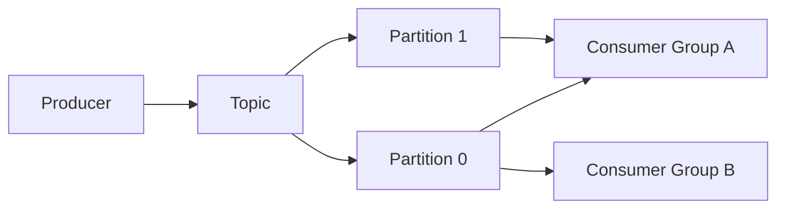
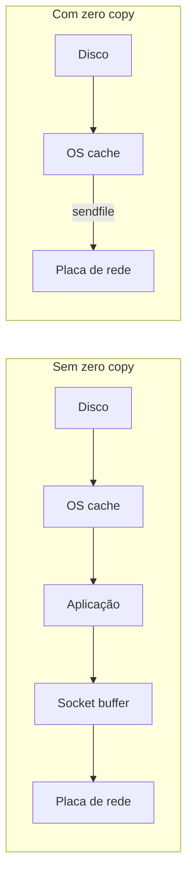

> [!abstract]
> Event Streaming Platform é um log distribuído, particionado e append-only que retém eventos por um período configurado, permitindo que múltiplos consumidores os leiam de forma independente e em seu próprio ritmo.

## Conceito

A diferença para uma [[Message Queue]] tradicional é o que acontece **depois** da leitura. Na fila clássica, a mensagem consumida some. No log de eventos, ela permanece: cada consumidor mantém seu próprio *offset*, pode reprocessar do início e novos consumidores podem ser adicionados sem coordenação com os existentes. É o que torna o mesmo fluxo reutilizável por analytics, auditoria e serviços operacionais ao mesmo tempo.

## Estrutura

Producer, broker, topic, partition e consumer group são os cinco elementos do modelo. A **partição** é a unidade de paralelismo e a única fronteira dentro da qual a ordem é garantida.

## Por que é rápido

Duas decisões de projeto respondem pela maior parte do desempenho:

1. **I/O sequencial.** A escrita é sempre no fim do log, transformando acesso aleatório em escrita sequencial — o padrão em que o disco é mais rápido.
2. **Zero copy.** Sem ele, o dado é copiado do OS cache para a aplicação, dela para o socket buffer e só então para a placa de rede. Com `sendfile()`, o OS cache entrega direto à placa de rede, eliminando as cópias entre contexto de kernel e de aplicação.

## Características

- Retenção por tempo ou tamanho, independente do consumo
- Reprocessamento por reposicionamento de offset
- Ordem garantida por partição, nunca por tópico
- Base natural para [[Event Sourcing]] e para arquiteturas orientadas a eventos

## Veja também

- [[Message Queue]]
- [[Event Sourcing]]
- [[Microservices]]
- [[Latency Numbers]]
- [[Object Storage]]
