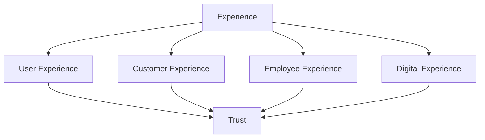

> [!abstract]
> Experience é a soma das percepções, emoções e julgamentos formados por um stakeholder ao longo de suas interações com uma organização, produto ou serviço.

## Conceito

A Versão 5 promove experiência a área própria — há uma publicação inteira dedicada a ela. A razão é econômica, não estética: em serviços digitais, a experiência é o único canal pelo qual a qualidade é percebida, e portanto o único pelo qual o valor é julgado.

Experiência não é medida por satisfação isolada. Ela é acumulativa e assimétrica: uma falha bem resolvida pode gerar mais confiança que dez operações normais; uma falha mal comunicada apaga meses de bom serviço.

## Estrutura

## Características

- Cumulativa: forma-se ao longo da [[Service Journey]], não num ponto
- Assimétrica: perdas pesam mais que ganhos equivalentes
- Multi-stakeholder: usuário, cliente e colaborador têm experiências distintas
- Converge para [[Trust]], que é seu resultado de longo prazo

## Veja também

- [[User Experience (UX)]]
- [[Customer Experience (CX)]]
- [[Employee Experience]]
- [[Digital Experience]]
- [[Trust]]
- [[Experience Management]]
