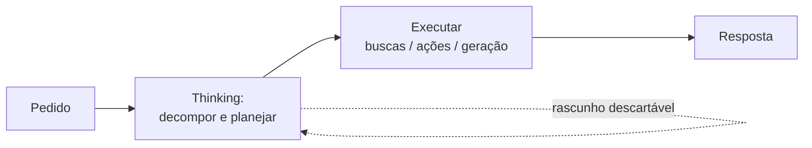

> [!abstract]
> **Extended Thinking** é o modo em que o modelo gasta tokens raciocinando **antes** de produzir a resposta — decompondo o problema, testando caminhos e descartando os ruins, em vez de responder no primeiro impulso.

## Conceito

Um modelo de linguagem gera token a token, cada um condicionado aos anteriores. Sem espaço de rascunho, todo o "pensamento" precisa acontecer dentro da resposta que já está sendo escrita — o que penaliza problemas em que a primeira direção plausível é a errada.

O raciocínio estendido dá esse espaço: o modelo escreve um encadeamento intermediário que não é a entrega final, e só depois responde. Troca-se **latência e custo por acurácia**, o que só compensa quando o problema é difícil o bastante.

## Onde ganha e onde não ganha

| Ganha muito | Ganha pouco |
|---|---|
| Matemática e cálculo em várias etapas | Recuperação de fato conhecido |
| Depuração de código | Reformatação de texto |
| Análise lógica e estratégica | Tradução |
| Planejamento antes de agir | Resposta conversacional curta |

> [!important] Thinking é raciocínio, não informação
> Se falta **dado externo**, pensar mais não ajuda — o que se precisa é de busca ou de [[Agentic Research]]. Thinking resolve o problema que já tem todos os elementos na mesa.

## Papel em fluxos agênticos

É a fase de planejamento de qualquer agente sério. Em [[Agentic Research]], é o que produz a decomposição da pergunta antes da primeira busca; em [[Agentic Workflow]], é o que produz o plano que você revisa antes da execução começar.

## Comparação

| | Extended Thinking | Resposta direta |
|---|---|---|
| Latência | Maior | Mínima |
| Custo em tokens | Maior | Menor |
| Acurácia em problema difícil | Maior | Menor |
| Acurácia em pergunta simples | Igual | Igual |

## Veja também

- [[Large Language Model (LLM)]]
- [[Agentic Research]]
- [[Agentic Workflow]]
- [[Agentic AI]]
- [[Context Window]]
