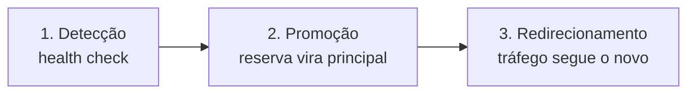

> [!abstract]
> Failover é a comutação automática de um componente que falhou para um componente de reserva — o mecanismo que transforma redundância em [[High Availability]].

## Conceito

Redundância sozinha não entrega disponibilidade: ter um segundo servidor não adianta se ninguém percebe que o primeiro caiu, ou se ninguém redireciona o tráfego. Failover é o que fecha esse laço, e ele tem três partes:

## Modos

| Modo | Como funciona | Custo | RTO |
|---|---|---|---|
| **Ativo-ativo** | Todos servem tráfego; a queda de um redistribui a carga | Alto | Quase zero |
| **Ativo-passivo (hot)** | A reserva está pronta e sincronizada | Médio-alto | Segundos |
| **Warm standby** | Reserva ligada em capacidade reduzida | Médio | Minutos |
| **Cold standby** | Reserva provisionada sob demanda | Baixo | Horas |

A escolha é determinada pelos objetivos de [[RTO]] e [[RPO]] do serviço, não por preferência técnica.

## Onde aparece no vault

- **[[DNS Routing Policy]]** — a política *failover* devolve o endpoint secundário quando o primário não responde
- **[[Load Balancer]]** — retira do pool a instância que falha no health check; é failover em nível de instância
- **[[Consensus]]** — eleição de novo líder quando o atual cai
- **[[Disaster Recovery]]** — failover entre regiões, o caso extremo

> [!warning] Failover não testado é fé, não é resiliência
> O caminho de failover só é exercitado quando algo dá errado — e é exatamente aí que se descobre que a réplica estava desatualizada, que o DNS tinha TTL de uma hora ou que a promoção exigia intervenção manual. É o argumento central de [[Chaos Engineering]].

> [!warning] Split-brain
> Se as duas metades de uma partição de rede decidirem, cada uma, que a outra caiu, ambas se promovem a principal e passam a aceitar escritas divergentes. É por isso que sistemas sérios exigem quórum antes de promover — ver [[Consensus]] e [[CAP Theorem]].

## Fonte

- Amazon Web Services, [Reliability Pillar — AWS Well-Architected Framework](https://docs.aws.amazon.com/wellarchitected/latest/reliability-pillar/welcome.html)

## Veja também

- [[High Availability]]
- [[Disaster Recovery]]
- [[RTO]]
- [[RPO]]
- [[DNS Routing Policy]]
- [[Consensus]]
- [[Chaos Engineering]]
