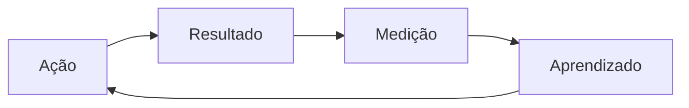

> [!abstract]
> Feedback Loop é o mecanismo pelo qual a saída de uma atividade retorna como entrada para a mesma atividade, permitindo que o sistema se corrija.

## Conceito

Sem loop de feedback, um sistema de trabalho é uma linha reta: ele executa até acabar e só descobre que errou no fim. Com o loop, o erro é detectado enquanto ainda é barato corrigir.

O ITIL usa loops em três escalas: dentro de uma atividade do ciclo de vida, entre atividades e entre a organização e seus consumidores. As três precisam existir — loops só internos produzem eficiência sem relevância.

## Estrutura

## Características

- Quanto mais curto o loop, mais barata a correção
- Precisa carregar informação acionável, não apenas dados
- É o que transforma medição em melhoria
- Sustenta [[Progress Iteratively with Feedback]] e [[Continual Improvement]]

## Veja também

- [[Continual Improvement]]
- [[Value Co-Creation]]
- [[Observability]]
- [[Progress Iteratively with Feedback]]
