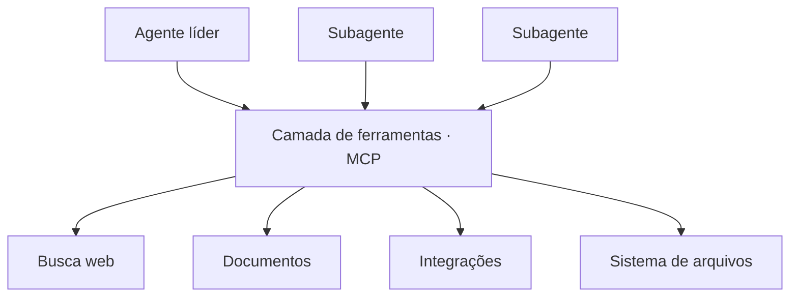

> [!abstract]
> Ferramentas compartilhadas são o conjunto de capacidades — busca, leitura, escrita, integrações — que os agentes de um sistema multiagente acessam em comum, e cujo **design determina o teto de desempenho** de todos eles.

## Conceito

> [!important] Design e seleção de ferramentas são críticos
> Usar a ferramenta certa é eficiente e, muitas vezes, estritamente necessário. Descrições ruins de ferramenta mandam agentes por caminhos completamente errados — **cada ferramenta precisa de um propósito distinto e uma descrição clara**.

Com [[Model Context Protocol (MCP)]], o problema se amplifica: os agentes encontram ferramentas que nunca viram, com descrições de qualidade muito variável, escritas por terceiros.

## Padronização como camada compartilhada

Padronizar a camada de ferramentas é o que permite trocar, adicionar e versionar capacidades sem reescrever cada agente — o papel que o [[Model Context Protocol (MCP)]] cumpre na arquitetura.

## Heurísticas que funcionaram

- **Examinar todas as ferramentas disponíveis antes de escolher**
- **Casar o uso da ferramenta com a intenção do usuário**
- **Preferir ferramentas especializadas às genéricas**
- Buscar na web apenas para exploração externa ampla

## Ferramentas melhorando ferramentas

A Anthropic criou um **agente de teste de ferramentas**: dada uma ferramenta MCP defeituosa, ele tenta usá-la repetidamente e reescreve a descrição para evitar as falhas encontradas. Depois de dezenas de tentativas, o agente identificou nuances e bugs — e a descrição reescrita produziu **40% de redução no tempo de conclusão** para os agentes seguintes.

> [!tip]
> É o mesmo princípio das ferramentas usadas por humanos: a maior parte do ganho de produtividade não vem de o operador se esforçar mais, vem de a ferramenta ser melhor. Investir na descrição e na ergonomia da ferramenta rende mais do que ajustar o prompt do agente.

## Fonte

- Anthropic, [How we built our multi-agent research system](https://www.anthropic.com/engineering/multi-agent-research-system), 2025

## Veja também

- [[Model Context Protocol (MCP)]]
- [[Agentes Especialistas]]
- [[Multi-Agent Systems]]
- [[Hierarquia de Agentes]]
- [[Harness]]
- [[Agent Runtime]]
- [[AI Generative Architecture]]
