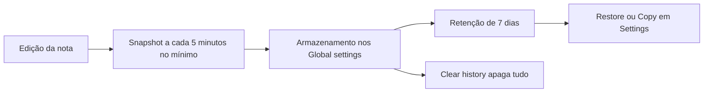

> [!abstract]
> **File recovery** é o core plugin que protege contra exclusões acidentais, corrupção e mudanças indesejadas salvando automaticamente *snapshots completos* das notas em intervalos regulares.

## Conceito

O File recovery ocupa um nicho estreito e preciso: desfazer um estrago recente **no mesmo dispositivo**. Ele não versiona intencionalmente (isso é [[Version History]]), nem protege contra perda do disco (isso é [[Backup]]). Cada snapshot guarda o **conteúdo integral** do arquivo, não o diff — o que permite restaurar qualquer versão anterior isoladamente, sem reconstruir uma cadeia de mudanças. Ver [[Snapshot]].

A decisão de projeto mais reveladora é onde os snapshots ficam: nos **Global settings**, fora do [[Vault]], justamente para sobreviver a perdas relacionadas ao vault. O preço dessa escolha é que o snapshot fica atrelado ao **caminho absoluto** da nota.

> [!quote]
> File recovery is not a complete backup solution, and we recommend also backing up your Obsidian files separately.

## Fluxo

## Características

- **Defaults**: intervalo mínimo de **5 minutos** entre snapshots, retenção de **7 dias**; ambos configuráveis em **Settings → Core plugins → File recovery**
- Snapshots capturam o conteúdo completo do arquivo, não apenas as mudanças
- Guardados nos Global settings, **fora do vault**, com o caminho absoluto da nota — se o vault foi movido, pode ser preciso devolvê-lo à localização de origem
- **Não sincronizam entre dispositivos**: são específicos de cada máquina, mesmo com [[Obsidian Sync]] ou outro serviço
- Recuperação por **Settings → File recovery → Snapshots → View**, com opções **Copy** e **Restore** e um toggle **Show changes** que exibe o que foi adicionado, removido ou modificado entre versões

> [!warning] Limitações declaradas
> Apenas arquivos `.md` e `.canvas` podem ser restaurados. O recurso é **indisponível** em dispositivos Apple com Lockdown mode ativo, a menos que o Obsidian seja isento. Mover o vault sem usar o vault switcher pode tornar os snapshots existentes inacessíveis.

> [!danger] Clear history
> Limpar o histórico de snapshots **apaga irreversivelmente** todos os snapshots do vault.

## Comparação

| | File Recovery | [[Version History]] | [[Backup]] |
|---|---|---|---|
| Granularidade | Snapshot completo por arquivo | Histórico de versões do serviço | Cópia do vault inteiro |
| Onde vive | Global settings, no dispositivo | No serviço de sync | Fora do dispositivo |
| Sincroniza | Não | Sim | Não se aplica |
| Cobre perda do disco | Não | Parcialmente | Sim |
| Escopo de arquivos | `.md` e `.canvas` | Conforme o serviço | Tudo |

## Veja também

- [[Backup]]
- [[Snapshot]]
- [[Version History]]
- [[Local-first]]
- [[Configuration Folder]]
