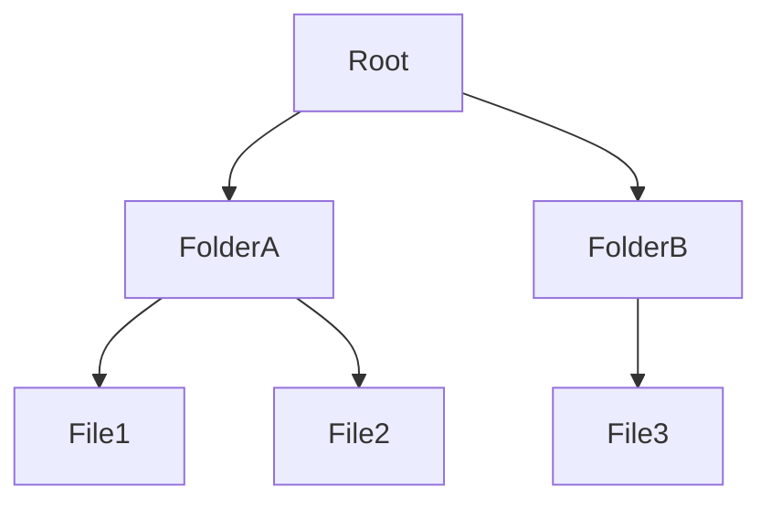

File Storage organiza dados em uma estrutura hierárquica composta por diretórios e arquivos.

É o modelo de armazenamento mais familiar para usuários e aplicações tradicionais.

> [!tip]
> Múltiplos servidores podem acessar simultaneamente o mesmo sistema de arquivos compartilhado.

## Protocolos comuns

- NFS
- SMB/CIFS

## Casos de uso

- Compartilhamento de arquivos
- Home directories
- Sistemas legados
- Conteúdo web

## Exemplos

- Amazon EFS
- Azure Files
- Google Filestore

## Vantagens

- Compartilhamento entre servidores
- Estrutura intuitiva
- Compatível com aplicações legadas

## Limitações

- Escalabilidade inferior ao Object Storage
- Pode apresentar gargalos em grandes volumes

## Veja também

- [[Storage]]
- [[Block Storage]]
- [[Object Storage]]