> [!abstract]
> O FHS é o padrão que define **onde cada tipo de arquivo mora** em sistemas tipo UNIX — o acordo que permite a um programa funcionar em distribuições diferentes.

## Conceito

Antes de 1994, o sistema de arquivos Linux lembrava uma cidade sem plano diretor: cada um construía onde queria. O FHS trouxe ordem, e o ganho é de **interoperabilidade**: aplicações, ferramentas de administração e scripts podem contar com um layout consistente entre distribuições.

Nem toda distribuição segue o padrão à risca — várias incorporam elementos próprios ou atendem requisitos específicos.

## A hierarquia a partir da raiz

```mermaid
flowchart TD
    R["/"] --> BIN["/bin · binários essenciais"]
    R --> BOOT["/boot · arquivos do bootloader"]
    R --> DEV["/dev · arquivos de dispositivo"]
    R --> ETC["/etc · configuração do host"]
    R --> HOME["/home · diretórios dos usuários"]
    R --> LIB["/lib · bibliotecas e módulos do kernel"]
    R --> OPT["/opt · pacotes adicionais"]
    R --> PROC["/proc · info do kernel e processos"]
    R --> SBIN["/sbin · binários de sistema"]
    R --> TMP["/tmp · arquivos temporários"]
    R --> USR["/usr · hierarquia secundária"]
    R --> VAR["/var · dados variáveis"]
```

| Diretório | O que guarda |
|---|---|
| `/etc` | Configuração **específica daquela máquina** |
| `/var` | Dado que **muda em operação**: log, cache, fila, spool |
| `/usr` | Programas e dados **somente leitura, compartilháveis** |
| `/opt` | Software de terceiros, fora do gerenciador de pacotes |
| `/proc` e `/sys` | Sistemas de arquivos **virtuais** — informação do kernel e dos [[Processo (Computação)|processos]], não arquivos em disco |
| `/run` | Dado variável de tempo de execução, perdido no reboot |

> [!important] A separação estática × variável é a chave
> `/usr` é imutável em operação; `/var` é o que muda. Essa distinção é o que torna possível montar `/usr` como somente leitura ou compartilhá-lo entre máquinas — e é o antepassado direto do raciocínio de [[Immutable Infrastructure]]: separar o que é definição do que é estado.

> [!tip]
> O caminho para dominar o padrão é explorar: `cd` para navegar, `ls` para listar. Ver [[Comandos Linux Essenciais]].

## Fonte

- LSB Workgroup, [Filesystem Hierarchy Standard 3.0](https://refspecs.linuxfoundation.org/FHS_3.0/fhs/index.html), The Linux Foundation, 2015

## Veja também

- [[Comandos Linux Essenciais]]
- [[Processo de Boot do Linux]]
- [[Immutable Infrastructure]]
- [[Container]]
- [[Logging]]
- [[System Design MOC]]
