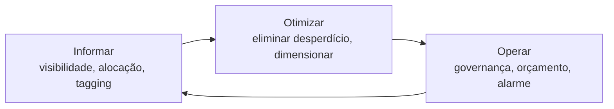

> [!abstract]
> FinOps é a prática cultural que traz responsabilidade financeira para a engenharia de nuvem: como o custo passou a ser consequência direta de decisões técnicas, quem projeta o sistema passa a ser corresponsável pela fatura.

## Conceito

No modelo de infraestrutura própria, custo era decisão de compra: anual, centralizada, feita antes do código existir. Na nuvem, **cada linha de código é uma decisão de gasto** tomada em tempo de execução, de forma descentralizada, por quem escreve. O orçamento deixou de ser antecedente e virou consequência.

FinOps não é "cortar custo". É tornar o custo **visível e atribuível** para que a decisão entre gastar e não gastar seja tomada com informação — às vezes a decisão certa é gastar mais.

## Ciclo

Nada funciona sem a primeira fase: um custo que não é atribuível a um time, produto ou tenant não pode ser gerido — só lamentado no fim do mês.

## O que muda em arquitetura serverless

O modelo pay-per-use é, ao mesmo tempo, o melhor e o mais traiçoeiro cenário de FinOps:

| Muda | Consequência |
|---|---|
| Custo ocioso ≈ zero | Ambiente parado não gera fatura — a intuição de "desligar" perde sentido |
| Custo é linear ao uso | Um bug em loop, um retry mal configurado ou um scan desnecessário viram gasto imediato |
| A granularidade é a requisição | É possível calcular o custo por tenant e por funcionalidade — e portanto precificar com base em dado real |
| Não há teto natural | Sem alarme de orçamento, a escala automática escala também a conta |

## As armadilhas típicas

> [!warning] Os serviços sem camada gratuita são os que surpreendem
> Boa parte da pilha serverless tem camada gratuita generosa. As exceções cobram desde o primeiro uso — barramento de eventos por evento publicado, gerenciador de segredos por segredo por mês, consulta analítica por terabyte varrido. São valores baixos que passam despercebidos no desenho e aparecem consolidados na fatura.

Outros focos recorrentes: **métrica customizada de alta cardinalidade** (ver [[Amazon CloudWatch]]), **varredura de tabela** em vez de consulta por chave (ver [[Amazon DynamoDB]]) e **falta de particionamento** no dado analítico (ver [[Amazon Athena]]).

## Alavancas de governança

- Tagging obrigatório por produto, ambiente e time, imposto pelo [[Infrastructure as Code]] — não por convenção
- Orçamento com alarme por conta e por ambiente, antes do primeiro deploy em produção
- Retenção explícita em logs e armazenamento; o padrão "guardar para sempre" é um custo que só cresce
- Revisão de custo como item recorrente da mesma cadência em que se revisa latência e erro

## Veja também

- [[Cloud Native Anti-Patterns]]
- [[Amazon CloudWatch]]
- [[Amazon Athena]]
- [[Serverless]]
- [[Service Financial Management]]
- [[Modelagem de Custo AWS Serverless]]
