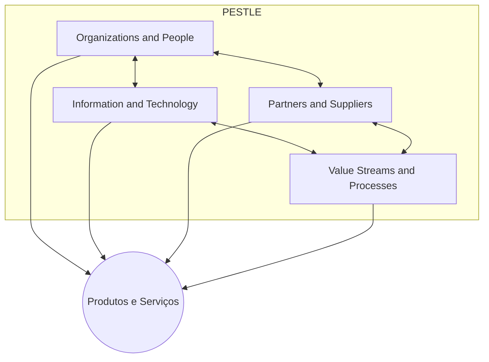

> [!abstract]
> As Quatro Dimensões são as perspectivas que precisam ser consideradas em conjunto para que produtos e serviços gerem valor de forma efetiva e eficiente.

## Conceito

O modelo existe para combater um padrão de falha específico: otimizar uma dimensão e degradar as outras. Automatizar um processo (informação e tecnologia) sem redesenhar papéis (organizações e pessoas) produz automação que ninguém opera. Contratar um fornecedor sem ajustar fluxo produz dependência sem ganho.

Na Versão 5 o diagrama foi redesenhado e duas dimensões ganharam conteúdo novo: *Organizations, people and AI* e o [[ITIL AI Capability Model]] dentro de informação e tecnologia.

## Estrutura

## Características

- As quatro se aplicam a todo produto e serviço, sem exceção
- Nenhuma pode ser otimizada isoladamente sem risco de degradar as outras
- Cercadas por fatores externos [[PESTLE]]
- Sustentam o princípio [[Think and Work Holistically]]

## Veja também

- [[Organizations and People]]
- [[Information and Technology]]
- [[Partners and Suppliers]]
- [[Value Streams and Processes]]
- [[PESTLE]]
- [[Think and Work Holistically]]
