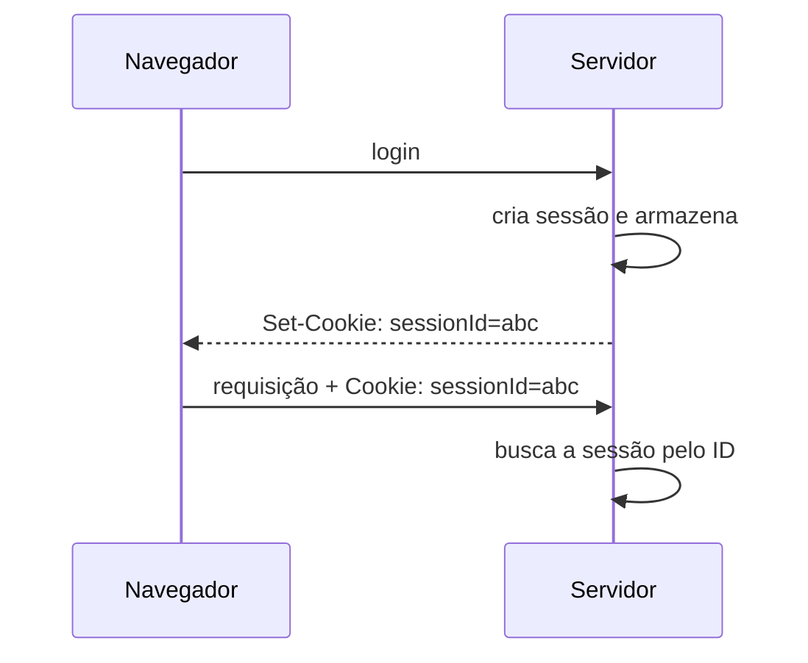

> [!abstract]
> Gerenciamento de sessão é como o sistema mantém a identidade do usuário através de requisições [[HTTP]] independentes — o protocolo é sem estado, mas a aplicação precisa lembrar quem está do outro lado.

## Conceito

HTTP não tem memória: cada requisição chega sozinha. Cookies e sessões existem para carregar informação do usuário entre elas — status de login, permissões, preferências.

## Cookie × Sessão

| | **Cookie** | **Sessão** |
|---|---|---|
| Onde o dado mora | No dispositivo do usuário | No servidor |
| Tamanho | Limitado, tipicamente 4 KB | Sem limite prático |
| Envio | Vai junto em cada requisição seguinte | Só o ID vai, dentro de um cookie |
| Acesso do cliente | Lê e pode manipular | Não acessa o conteúdo |
| Segurança | Menor | Maior |
| Controle do usuário | Pode bloquear no navegador | Depende do cookie do ID |

Os dois não são alternativas: a sessão **usa** o cookie para transportar o identificador.

## O custo em arquitetura distribuída

> [!warning]
> Sessão no servidor é estado no servidor — exatamente o que a restrição *stateless* de [[REST API]] elimina e o que [[Immutable Infrastructure]] pressupõe ausente. Em várias instâncias atrás de um [[Load Balancer]], ou se usa afinidade de sessão (que quebra o balanceamento e perde a sessão quando o nó cai), ou se externaliza a sessão em [[Distributed Cache]].
>
> A alternativa é não ter sessão no servidor: é o argumento a favor de [[JSON Web Token (JWT)]].

## Boas práticas

- ID de sessão **longo, aleatório e imprevisível** — é a credencial de fato depois do login
- Cookies com `Secure`, `HttpOnly` e `SameSite`
- **Rotacionar o ID após o login**, para impedir fixação de sessão
- Expiração por inatividade e expiração absoluta
- Invalidar no servidor ao encerrar a sessão — apagar o cookie do cliente não basta

## Fonte

- OWASP, [Session Management Cheat Sheet](https://cheatsheetseries.owasp.org/cheatsheets/Session_Management_Cheat_Sheet.html)
- ByteByteGo, *What are the differences between cookies and sessions?* — BIG ARCHIVE: System Design 2023

## Veja também

- [[JSON Web Token (JWT)]]
- [[Single Sign-On (SSO)]]
- [[OAuth 2.0]]
- [[HTTP]]
- [[Distributed Cache]]
- [[System Design MOC]]
