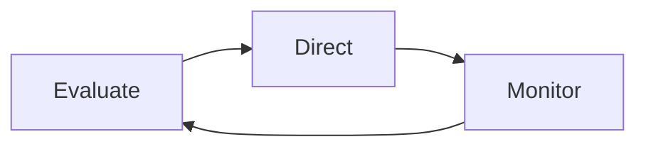

> [!abstract]
> Governance é o sistema pelo qual a organização é dirigida e controlada — definindo direção, avaliando desempenho e monitorando conformidade.

## Conceito

Governança responde por três verbos: **avaliar**, **dirigir** e **monitorar**. A distinção que mais importa na prática é entre governança e gestão: governança decide o que deve ser alcançado e quem responde por isso; gestão decide como alcançar.

Confundir as duas produz os dois erros clássicos: conselhos que microgerenciam decisões técnicas, e times autônomos sem critério de decisão quando os objetivos conflitam.

## Estrutura

## Características

- Define accountability, não apenas responsabilidade
- Traduz [[Strategy]] em direção e política
- Estabelece apetite a [[Risk]] e limites de decisão
- Componente do [[ITIL Value System]]

## Comparação

| | Governança | Gestão |
|---|---|---|
| Pergunta | O que deve ser alcançado? | Como alcançar? |
| Produto | Direção, política, limites | Planos, execução, entregas |
| Horizonte | Longo | Curto e médio |

## Veja também

- [[ITIL Value System]]
- [[Strategy]]
- [[Risk Management]]
- [[ITIL AI Governance]]
- [[Compliance]]
