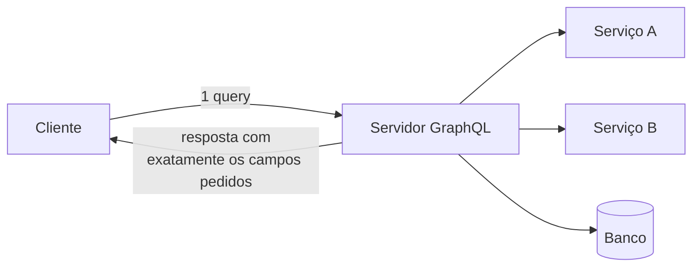

> [!abstract]
> GraphQL é uma linguagem de consulta para APIs em que o **cliente descreve exatamente os dados que quer** e recebe exatamente isso — nem mais, nem menos.

## Conceito

Em [[REST API]], o servidor define o formato de cada resposta. O cliente que precisa de três campos recebe trinta (*over-fetching*); o cliente que precisa de dados de três recursos faz três chamadas (*under-fetching*). GraphQL inverte o controle: o **schema** publica tudo que existe, e a query do cliente seleciona o subconjunto.

O servidor GraphQL fica entre o cliente e os serviços de backend, organizando os recursos como um **grafo** e podendo agregar múltiplas chamadas REST internas em uma única query.

## As três operações

| Operação | Para quê |
|---|---|
| **Query** | Ler dados |
| **Mutation** | Modificar dados |
| **Subscription** | Receber atualizações em tempo real |

## Características

- **Sistema de tipos forte** no schema — a validação da query acontece antes da execução
- **Versionless**: campos novos são adicionados e campos velhos, depreciados, sem `/v2`
- **Introspecção**: o schema descreve a si mesmo, o que alimenta ferramentas e documentação automática
- **Resolvers** executam a query campo a campo

> [!warning] O problema N+1 é estrutural aqui
> Como cada campo tem seu resolver, uma query que pede 100 itens com um campo aninhado dispara 101 consultas ao backend. Não é um bug de implementação, é o modelo de execução — a mitigação padrão é *batching* com DataLoader.

> [!warning] Cache e segurança mudam de lugar
> O cache HTTP por URL deixa de funcionar: tudo é `POST` no mesmo endpoint, e o cache precisa subir para a camada de aplicação. E, como o cliente monta a query, ele pode montar uma **query maliciosamente profunda** — daí a necessidade de limites de profundidade e complexidade.

> [!important]
> GraphQL não é banco de dados nem substituto universal de REST. É uma camada de consulta sobre fontes que já existem; a escolha entre os dois é uma decisão de quem controla o formato da resposta.

## Fonte

- GraphQL Foundation, [Learn GraphQL](https://graphql.org/learn/) e [GraphQL Specification](https://spec.graphql.org)

## Veja também

- [[REST API]]
- [[Estilos de Arquitetura de API]]
- [[gRPC]]
- [[API Gateway]]
- [[Database Index]]
- [[System Design MOC]]
