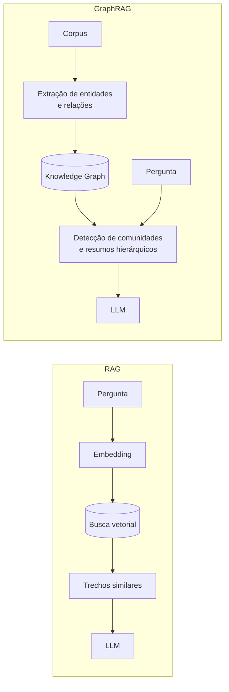

> [!abstract]
> GraphRAG combina [[Retrieval-Augmented Generation (RAG)]] com um [[Knowledge Graph]] construído a partir do corpus, permitindo responder perguntas **globais** que a busca por similaridade não alcança.

## Conceito

O RAG clássico recupera os trechos mais semelhantes à pergunta e os entrega ao modelo. Isso funciona bem quando a resposta está **em algum lugar específico** do corpus.

Falha quando a pergunta é global — "quais são os temas principais deste conjunto de documentos?" — porque nenhum trecho isolado contém a resposta. A similaridade não tem como recuperar algo que só existe na **relação entre** os documentos.

O pipeline extrai entidades e relações do corpus, monta o grafo, detecta comunidades de nós fortemente conectados e gera **resumos hierárquicos** dessas comunidades. A pergunta global é respondida a partir desses resumos, não de trechos brutos.

## Comparação

| | **RAG** | **GraphRAG** |
|---|---|---|
| Estrutura de recuperação | Índice vetorial | Grafo de entidades e relações |
| Bom para | Perguntas locais e específicas | Perguntas globais e temáticas |
| Raciocínio multi-hop | Fraco | Forte — segue arestas |
| Custo de indexação | Baixo | Alto — exige extração com LLM |
| Explicabilidade | Trecho citado | Caminho no grafo |

> [!important] A ponte entre dois clusters do vault
> GraphRAG é onde [[Retrieval-Augmented Generation (RAG)]] e [[Knowledge Graph]] deixam de ser abordagens alternativas de conhecimento e passam a ser uma só. O grafo deixa de ser um repositório consultado e vira **a estrutura de recuperação**.

> [!warning]
> O custo de construção é substancial: extrair entidades e relações de um corpus grande exige muitas chamadas de LLM, e o grafo precisa ser reconstruído ou atualizado conforme o corpus muda. Só compensa quando as perguntas globais são a necessidade real.

## Fonte

- Darren Edge et al., [From Local to Global: A Graph RAG Approach to Query-Focused Summarization](https://arxiv.org/abs/2404.16130), Microsoft Research, 2024

## Veja também

- [[Retrieval-Augmented Generation (RAG)]]
- [[Knowledge Graph]]
- [[Context Graph]]
- [[Large Language Model (LLM)]]
- [[Multi-Agent Systems]]
- [[AI Generative Architecture]]
