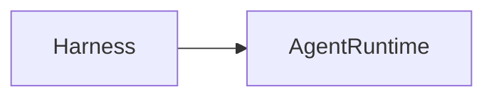

> [!abstract]
> Um **Harness** é uma estrutura de suporte responsável por preparar, executar e monitorar modelos ou agentes durante uma tarefa.

## Conceito

O termo *Harness* significa literalmente "arnês" ou "estrutura de suporte".

Em Engenharia de Software, representa o ambiente que fornece todos os recursos necessários para executar um componente de forma controlada.

Na IA Generativa, um Harness normalmente é responsável por:

- inicializar o modelo
- carregar prompts
- configurar ferramentas
- gerenciar contexto
- registrar logs
- executar avaliações
- monitorar a execução

Dependendo do objetivo, diferentes tipos de Harness podem existir.

---

## Tipos comuns

- Model Harness
- Agent Harness
- Evaluation Harness
- Testing Harness

Cada um possui responsabilidades específicas, mas todos têm em comum o fato de fornecer infraestrutura para execução.

---

## Características

- Ambiente de execução
- Configuração
- Observabilidade
- Reprodutibilidade
- Monitoramento
- Integração de componentes

---

## Relação com Agent Runtime

Um Harness normalmente representa uma implementação mais simples e localizada.

À medida que a arquitetura evolui para múltiplos agentes, memória, planejamento e coordenação, surge o conceito de [[Agent Runtime]], que amplia significativamente suas responsabilidades.

> [!note]
> Muitos frameworks utilizam o termo **Harness** internamente, mesmo quando sua implementação já possui características de um Agent Runtime.

---

## Veja também

- [[Agent Runtime]]
- [[Agent Supervisor]]
- [[Model Context Protocol (MCP)]]
- [[Large Language Model (LLM)]]