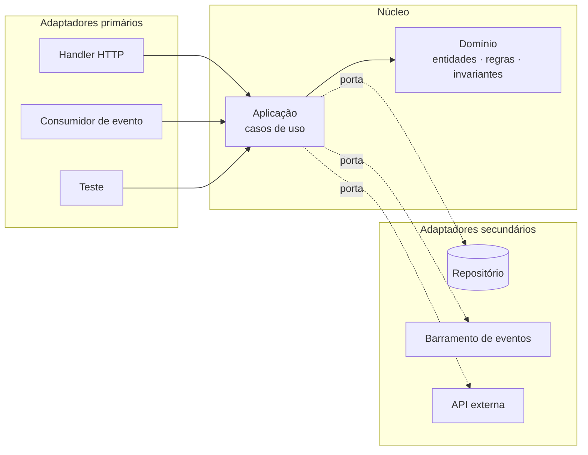

> [!abstract]
> Arquitetura hexagonal isola a lógica de negócio de toda tecnologia externa através de **portas** — interfaces definidas pelo domínio — implementadas por **adaptadores** que traduzem o mundo exterior para elas.

## Conceito

A formulação original de Cockburn ataca um sintoma específico: a regra de negócio que só é executável dentro de um servidor, com um banco de pé e um cliente HTTP chamando. Quando o domínio depende de infraestrutura, ele não é testável isoladamente, não é portável, e cada troca de tecnologia vira reescrita.

A inversão é simples de enunciar e difícil de sustentar: **a dependência aponta sempre para dentro**. O domínio define a interface de que precisa (`RepositorioDePedidos`); a infraestrutura a implementa. O domínio nunca importa nada da infraestrutura.



## Primários × secundários

| | **Primário** (driving) | **Secundário** (driven) |
|---|---|---|
| Quem inicia | O adaptador chama o núcleo | O núcleo chama o adaptador |
| Exemplos | Handler HTTP, consumidor de fila, CLI, teste | Repositório, publicador de eventos, cliente de API externa |
| A porta é | O caso de uso exposto | A interface exigida pelo domínio |

## Em contexto serverless

O `handler.ts` de uma função é apenas um **adaptador primário**: traduz o evento do provedor em uma chamada de caso de uso e o resultado em resposta HTTP. Ele não contém regra.

Isso tem um efeito prático que compensa o esforço: a mesma regra de negócio serve a uma rota HTTP, a um consumidor de fila e a um trigger de stream, sem duplicação — porque nenhum dos três está dentro dela. E o teste do domínio roda em milissegundos, sem emular a nuvem.

```
lambda/{dominio}/
├── criar.handler.ts          ← adaptador primário (fino)
├── domain/                   ← entidades, objetos de valor, invariantes
├── application/              ← casos de uso; define as portas
└── infrastructure/           ← adaptadores secundários (repositório, SDK)
```

> [!warning] O custo é real
> Hexagonal introduz indireção. Em um CRUD trivial, a interface e o adaptador podem ser cerimônia pura. O critério é a densidade de regra: onde há invariante de negócio a proteger, o isolamento paga; onde é passa-dado, ele só adiciona arquivos.

## Veja também

- [[Domain Driven Design]]
- [[Bounded Context]]
- [[Microservices]]
- [[Arquitetura Evolutiva]]
- [[AWS Lambda]]
