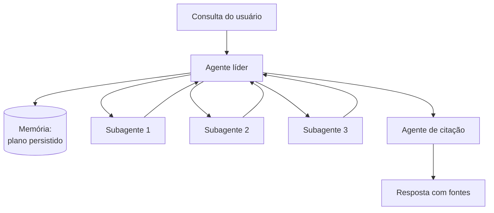

> [!abstract]
> Hierarquia de agentes é o padrão **orquestrador-trabalhador**: um agente líder coordena o processo e delega a subagentes especializados que operam em paralelo.

## Conceito

Quando o usuário submete uma consulta, o agente líder a analisa, desenvolve uma estratégia e cria subagentes para explorar aspectos diferentes simultaneamente. Os subagentes atuam como filtros inteligentes — usam ferramentas de busca iterativamente e devolvem achados ao líder, que sintetiza a resposta final.

O líder salva o plano em memória antes de delegar: se a janela de contexto passar do limite, ela é truncada, e perder o plano significa perder a estratégia inteira.

## Como delegar bem

> [!important] Instrução vaga é a causa nº 1 de falha
> Cada subagente precisa de **objetivo, formato de saída, orientação sobre ferramentas e fontes, e limites claros de tarefa**. Sem isso, os agentes duplicam trabalho, deixam lacunas ou não encontram o necessário.
>
> No relato da Anthropic, instruções curtas como "pesquise a escassez de semicondutores" fizeram um subagente explorar a crise automotiva de 2021 enquanto dois outros duplicavam trabalho sobre 2025 — sem divisão efetiva de trabalho.

## Escalar o esforço à complexidade

Agentes têm dificuldade de julgar o esforço adequado, então as regras de escala são embutidas no prompt:

| Complexidade | Configuração |
|---|---|
| Busca simples de fato | 1 agente, 3–10 chamadas de ferramenta |
| Comparação direta | 2–4 subagentes, 10–15 chamadas cada |
| Pesquisa complexa | Mais de 10 subagentes, com responsabilidades bem divididas |

Sem esse guia, o modo de falha comum é o **superinvestimento em consultas simples** — inclusive criar 50 subagentes para uma pergunta trivial.

## Fonte

- Anthropic, [How we built our multi-agent research system](https://www.anthropic.com/engineering/multi-agent-research-system), 2025

## Veja também

- [[Multi-Agent Systems]]
- [[Agent Supervisor]]
- [[Agentes Especialistas]]
- [[Agentes Paralelos]]
- [[Agent Runtime]]
- [[Human-in-the-Loop]]
- [[AI Generative Architecture]]
