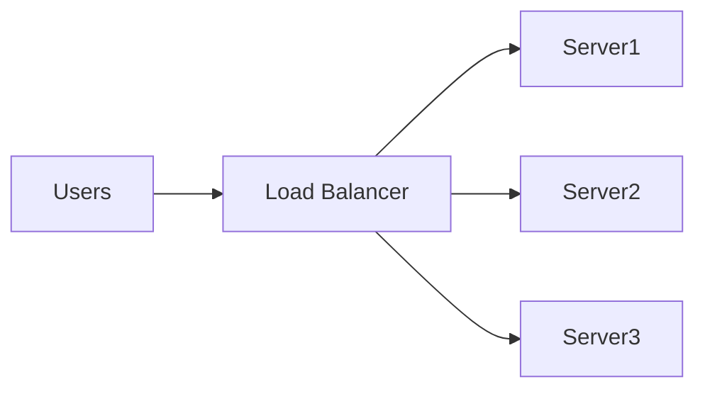

High Availability (HA) é uma característica de sistemas projetados para permanecerem operacionais mesmo quando ocorre a falha de um ou mais componentes.

O objetivo é minimizar interrupções e garantir que o serviço continue disponível aos usuários.

> [!info]
> Alta disponibilidade é obtida por meio de redundância, balanceamento de carga e eliminação de pontos únicos de falha.

## Princípios

- Redundância
- Failover automático
- Balanceamento de carga
- Monitoramento contínuo

## Exemplos

- Múltiplas Availability Zones
- Clusters Kubernetes
- Bancos de dados replicados

## Relação com outros conceitos

- Alta disponibilidade reduz indisponibilidade.
- [[Disaster Recovery]] trata da recuperação após grandes falhas.
- [[Business Continuity]] engloba ambos.

## Veja também

- [[Disaster Recovery]]
- [[Business Continuity]]
- [[Load Balancer]]
- [[Failover]]