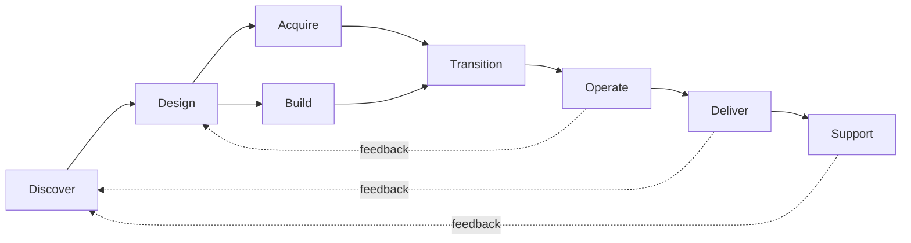

> [!abstract]
> O ITIL Product and Service Lifecycle é o modelo operacional da Versão 5 que descreve as oito atividades pelas quais produtos e serviços digitais são criados, entregues e sustentados. Substitui a Service Value Chain do ITIL 4.

## Conceito

A mudança de nome não é cosmética. A *Service Value Chain* da v4 descrevia como a demanda vira valor; o *Product and Service Lifecycle* descreve como um produto vive — o que inclui construir, adquirir e aposentar.

As oito atividades **não são fases sequenciais**. São modos de trabalho que se combinam em [[Value Stream]]s distintos: um incidente percorre Support → Operate; uma feature nova percorre Discover → Design → Build → Transition → Deliver. Tratá-las como etapas de um funil reintroduz exatamente o modelo em cascata que o ITIL 5 tenta abandonar.

Como conjunto, essas oito atividades formam o componente **Value Chain** do [[ITIL Value System]].

## Estrutura

## As oito atividades

| Atividade | Pergunta que responde |
|---|---|
| [[Discover (Lifecycle)]] | O que o mercado e a estratégia pedem? |
| [[Design (Lifecycle)]] | Como a solução deve ser? |
| [[Acquire (Lifecycle)]] | O que compramos ou contratamos? |
| [[Build (Lifecycle)]] | Como construímos e validamos? |
| [[Transition (Lifecycle)]] | Como colocamos em produção com segurança? |
| [[Operate (Lifecycle)]] | Como mantemos funcionando? |
| [[Deliver (Lifecycle)]] | Como o consumidor acessa e consome? |
| [[Support (Lifecycle)]] | Como restauramos e ajudamos quando falha? |

## Comparação

| | Service Value Chain (ITIL 4) | Product and Service Lifecycle (ITIL 5) |
|---|---|---|
| Atividades | 6 | 8 |
| Foco | Fluxo de demanda a valor | Vida do produto e do serviço |
| Aquisição | Dentro de *Obtain/Build* | [[Acquire (Lifecycle)]] separada de [[Build (Lifecycle)]] |
| Entrega e suporte | *Deliver and Support* unificadas | [[Deliver (Lifecycle)]] e [[Support (Lifecycle)]] separadas |

## Veja também

- [[ITIL Value System]]
- [[Value Stream]]
- [[Digital Product and Service Management]]
- [[Retirement]]
