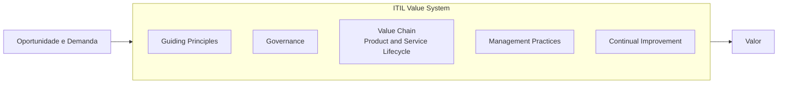

> [!abstract]
> O ITIL Value System (IVS) é o modelo que descreve como todos os componentes e atividades de uma organização funcionam juntos para habilitar a criação de valor. Na Versão 5 substitui o nome Service Value System do ITIL 4.

## Conceito

O IVS é a resposta do ITIL a um problema estrutural: silos organizacionais que funcionam bem isoladamente e produzem um todo lento e incoerente. O sistema define os cinco componentes que precisam operar juntos para que oportunidade e demanda virem valor.

A renomeação de *Service* Value System para *ITIL* Value System acompanha a mudança de escopo — o sistema já não trata só de serviços, mas de produtos e serviços digitais.

## Componentes

| Componente | Papel |
|---|---|
| [[Guiding Principles]] | Orientam decisão em qualquer nível |
| [[Governance]] | Direção, avaliação e monitoramento |
| [[Value Chain]] | As oito atividades do [[ITIL Product and Service Lifecycle]] |
| [[Management Practices]] | As 34 práticas que executam o trabalho |
| [[Continual Improvement]] | Melhoria recorrente de tudo acima |

## Comparação

| | Service Value System (ITIL 4) | ITIL Value System (ITIL 5) |
|---|---|---|
| Escopo | Gestão de serviços | Gestão de produtos e serviços digitais |
| Value Chain | Service Value Chain, 6 atividades | Product and Service Lifecycle, 8 atividades |
| Visualização | Circular com SVC ao centro | Redesenhada na v5 |
| Práticas | 34 em 3 grupos | 34 em 2 grupos |

## Veja também

- [[ITIL]]
- [[ITIL Product and Service Lifecycle]]
- [[Guiding Principles]]
- [[Governance]]
- [[Management Practices]]
- [[Continual Improvement]]
