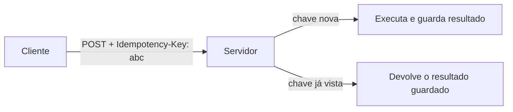

> [!abstract]
> Idempotência é a propriedade de uma operação cujo efeito é o mesmo sendo executada uma ou muitas vezes — a única resposta estrutural ao `UNKNOWN` dos [[Distributed Systems]].

## Conceito

Quando uma chamada remota expira, o cliente não sabe se a operação aconteceu. Retentar arrisca duplicar o efeito; não retentar arrisca perder a operação. Não existe terceira opção — a menos que repetir seja **inofensivo por construção**.

`GET` e `DELETE` são idempotentes por definição. O problema mora nas operações que criam ou alteram estado.

## Chave de idempotência

O mecanismo padrão de mercado, popularizado pela Stripe:

1. O **cliente** gera uma chave única por operação — UUID v4 ou outra string com entropia suficiente para evitar colisão
2. O servidor guarda o status e o corpo da **primeira** resposta associada àquela chave, tenha ela dado sucesso ou erro
3. Requisições subsequentes com a mesma chave devolvem o mesmo resultado, inclusive erros `500`
4. As chaves expiram (na Stripe, após 24 h); reutilizar uma chave já expurgada gera nova requisição

> [!warning] Detalhes que definem se funciona
> - A chave é gerada pelo **cliente**, não pelo servidor — só o cliente sabe que aquilo é uma retentativa da mesma intenção
> - Os parâmetros de entrada são comparados aos da requisição original; divergência gera erro, para impedir uso acidental da mesma chave em operações diferentes
> - Nunca usar dado sensível (e-mail, identificador pessoal) como chave

## Por que é pré-requisito, não refinamento

A idempotência é o que torna [[Retry Pattern]] seguro. Sem ela, toda retentativa de uma operação com efeito colateral é uma aposta. É também exigência de qualquer consumidor de [[Message Queue]] — brokers entregam mais de uma vez por desenho — e do [[Outbox Pattern]], em que o relay pode publicar a mesma mensagem duas vezes ao reiniciar.

> [!tip]
> Uma implementação comum e barata no lado consumidor é **rastrear os IDs já processados**. Não é tão robusta quanto uma chave de idempotência ponta a ponta, mas cobre a maioria dos casos de reentrega.

## Fonte

- Stripe, [Idempotent requests](https://docs.stripe.com/api/idempotent_requests), API Reference
- Marc Brooker, [Timeouts, retries, and backoff with jitter](https://aws.amazon.com/builders-library/timeouts-retries-and-backoff-with-jitter/), Amazon Builders' Library

## Veja também

- [[Retry Pattern]]
- [[Distributed Systems]]
- [[Message Queue]]
- [[Outbox Pattern]]
- [[Saga]]
- [[System Design MOC]]
