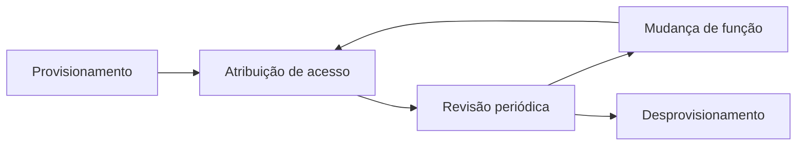

> [!abstract]
> IAM é a disciplina que administra o **ciclo de vida das identidades** e das permissões associadas a elas — de quem entra na organização a quem sai, passando por tudo que muda no meio.

## Conceito

[[Authentication]] e [[Authorization]] são decisões pontuais. IAM é o sistema que as torna possíveis e governáveis: quem existe, o que cada um pode, quem aprovou, quando expira e o que aconteceu.

## Componentes

| Componente | Papel |
|---|---|
| **Diretório de identidades** | A fonte da verdade sobre quem existe |
| **Provisionamento** | Cria, altera e remove contas conforme o ciclo de vida |
| **Política de acesso** | Declara quem pode o quê — ver [[Authorization]] |
| **[[Single Sign-On (SSO)]] e [[Identity Federation]]** | Autenticação centralizada e confiança entre domínios |
| **Identidades não humanas** | Serviços, funções e cargas de trabalho — hoje a maioria das identidades |
| **Auditoria** | Registro de quem acessou o quê, insumo de [[Compliance]] |

> [!warning] Desprovisionamento é o elo mais fraco
> Criar acesso tem dono, urgência e alguém cobrando. Remover não tem nenhum dos três. O resultado é o acúmulo de contas órfãs e de permissões residuais de funções antigas — o *privilege creep* — que é exatamente o que um atacante procura.
>
> A contramedida é revisão periódica de acesso, com evidência, e não confiança na saída do processo de RH.

> [!important] A maioria das identidades não é humana
> Em ambiente de nuvem, funções de serviço, contas de aplicação e cargas de trabalho superam em muito os usuários. Elas têm chaves que não expiram, ninguém as revisa e frequentemente carregam permissões amplas demais — o caminho mais comum para escalonamento de privilégio.

## Fonte

- NIST, [SP 800-63 — Digital Identity Guidelines](https://pages.nist.gov/800-63-3/)
- Amazon Web Services, [IAM Documentation](https://docs.aws.amazon.com/iam/)

## Veja também

- [[Authentication]]
- [[Authorization]]
- [[Identity Federation]]
- [[Single Sign-On (SSO)]]
- [[Zero Trust]]
- [[Information Security Management]]
- [[Compliance]]
