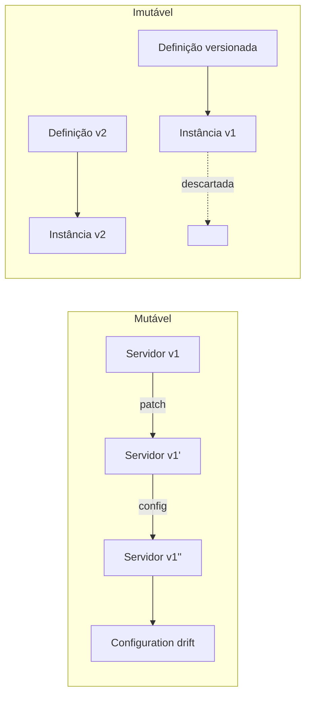

> [!abstract]
> Immutable Infrastructure é o princípio de que componentes de infraestrutura nunca são modificados após provisionados: qualquer mudança gera uma nova instância, e a antiga é descartada.

## Conceito

Servidores tradicionais são tratados como pacientes: instalam-se patches, ajusta-se configuração, corrige-se o que quebrou. Depois de meses de intervenções, nenhuma máquina é idêntica à outra e ninguém sabe reproduzi-las — é o *configuration drift*.

A infraestrutura imutável inverte isso: a máquina é **descartável**. Não se corrige, substitui-se por uma nova construída a partir da mesma definição versionada.

## Características

- Toda mudança passa pela definição versionada, nunca pela máquina em execução
- Rollback é trocar de volta para a imagem anterior, não desfazer alterações
- Ambientes ficam reproduzíveis por construção — dev, staging e produção nascem da mesma definição
- Depende de [[Infrastructure as Code]] para o provisionamento e de [[Container]] como unidade natural de empacotamento

> [!important] Gado, não bichinho de estimação
> A metáfora consagrada: bichinho de estimação tem nome, é tratado quando adoece e sua morte é um incidente. Gado tem número, é substituído quando adoece e sua morte é rotina. Infraestrutura imutável é a decisão de tratar servidores como gado.

> [!warning]
> Não é gratuita: exige que **todo** estado esteja fora da instância. Log local, upload em disco e sessão em memória quebram o modelo — e são exatamente os componentes com estado listados em [[Cloud Native Anti-Patterns]].

## Veja também

- [[Infrastructure as Code]]
- [[Container]]
- [[Cloud Native]]
- [[Cloud Native Anti-Patterns]]
- [[Pipeline de CI-CD]]
- [[DevOps]]
