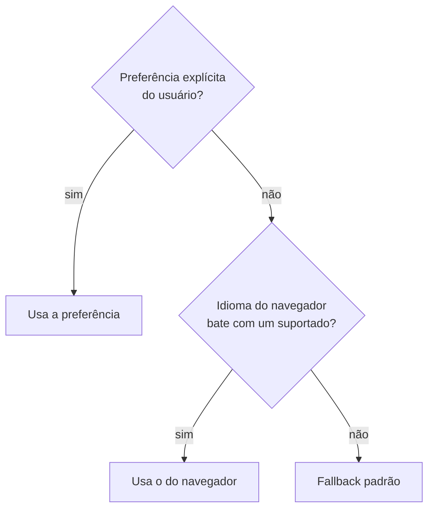

> [!abstract]
> Internacionalização (i18n) é preparar o software para operar em qualquer idioma e região sem alterar o código; localização (l10n) é adaptá-lo a um idioma e região específicos.

## Conceito

A distinção define quem faz o quê e quando. **i18n é trabalho de engenharia, feito uma vez**: extrair todo texto do código, formatar número, data e moeda pela biblioteca do locale, e suportar plural e direção de escrita. **l10n é trabalho de conteúdo, repetido por idioma**: traduzir, adaptar exemplos, ajustar convenções culturais.

O erro estrutural é adiar a i18n. Adicionar um segundo idioma a uma base que nunca separou texto de código não é uma tarefa incremental — é varrer o repositório inteiro atrás de literais.

## Resolução do locale

A ordem importa e é frequentemente invertida por engano: a **escolha explícita do usuário sempre vence o navegador**. Um usuário que selecionou português e recebe inglês porque trocou de máquina perdeu a confiança na preferência.

## Regras que evitam a maior parte dos defeitos

| Regra | Motivo |
|---|---|
| Um arquivo de locale **canônico** (idioma padrão) define todas as chaves | Sem uma referência, ninguém sabe o que falta traduzir |
| Chave ausente em um idioma cai no fallback silenciosamente | Produz interface bilíngue sem erro visível — precisa de verificação automatizada no CI |
| Chave presente só em um idioma secundário é lixo | Órfã: nunca é lida, mas é mantida para sempre |
| Formato de tag único e explícito (`pt_BR`, não `pt-br`/`pt`/`ptBR`) | Variação de formato quebra a correspondência em pontos aleatórios |
| A preferência tem **uma** fonte de verdade | Duplicá-la entre perfil, store e armazenamento local garante divergência |

## O que quase sempre é esquecido

- **Plural não é `if (n === 1)`**: idiomas têm de uma a seis formas plurais. Use a regra CLDR da biblioteca
- **Concatenação quebra tradução**: `"Você tem " + n + " itens"` não é traduzível — a ordem das palavras muda entre idiomas. Use interpolação em uma chave inteira
- **Data, número e moeda** pertencem ao formatador de locale, nunca a `toString` manual
- **Expansão de texto**: uma frase em inglês cresce até 40 % em outros idiomas — layouts rígidos quebram
- Conteúdo vindo do backend (mensagem de erro, nome de status) também precisa ser localizável: envie **código**, não frase pronta

> [!important] Mensagem de erro da API é conteúdo de UI
> Se o backend devolve texto final ao usuário, ele passa a ser dono da tradução. O contrato correto entrega um `code` estável, e o frontend resolve a mensagem no idioma ativo — o mesmo código serve para log, métrica e tradução.

## Veja também

- [[Internacionalização de Aplicação Frontend]]
- [[Progressive Web App (PWA)]]
- [[Contrato de API Padronizado]]
