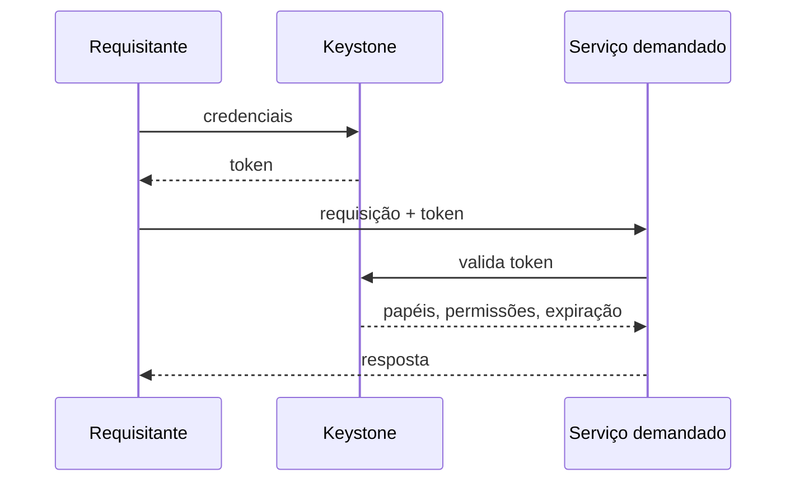

> [!abstract]
> Serviço de identidade do OpenStack: autentica requisitantes, autoriza ações e mantém o catálogo de endpoints de todos os demais serviços.

## Conceito

Keystone é o **hub de segurança** do ecossistema. Toda requisição a qualquer serviço precisa apresentar um token emitido por ele, e o serviço demandado revalida esse token contra o Keystone antes de responder.

O segundo papel, menos óbvio e igualmente estrutural, é o **catálogo de serviços**: é o Keystone que sabe onde cada serviço vive. Sem ele, os serviços não se encontram.

## Estrutura

## Características

Modelo de dados hierárquico:

| Termo | Definição |
|---|---|
| **Domain** | Contém usuários, grupos e projetos. Útil para isolar departamentos |
| **Project** | Substituiu *tenant* na API v3. Isola um conjunto de recursos |
| **Role** | Permite o mesmo usuário em projetos distintos com autorizações distintas |
| **User / Group** | Requisitante de API / coleção de requisitantes do mesmo domínio |
| **Catalog** | Registro dos endpoints de todos os serviços |
| **Token** | Valida usuário, expiração, projetos e endpoints alcançáveis |

**Backends de identidade:** SQL (padrão), LDAP (Keystone lê e escreve, mas não é IdP) e **IdP federado** — Keystone vira service provider e estabelece relação de confiança via SAML2, OpenID Connect sobre OAuth ou Active Directory. Ver [[Identity Federation]].

**Tokens:** os **Fernet** substituíram os baseados em PKI como padrão. Um token *unscoped* não carrega escopo de autorização e evita loops de autenticação; depois é reduzido a *scoped* para limitar o alcance.

> [!warning] O padrão não serve para produção
> A configuração default deixa lacunas de segurança. Governança e compliance exigem decidir explicitamente domínio, projeto, papel e backend.

> [!tip] Keystone é o primeiro suspeito
> Numa falha de serviço, a boa prática de troubleshooting é verificar antes de tudo se as requisições ao Keystone estão íntegras — uma autenticação falha se manifesta ao usuário como falha do serviço final.

## Veja também

- [[Authentication]]
- [[Authorization]]
- [[Identity Federation]]
- [[Single Sign-On (SSO)]]
- [[OpenStack]]
