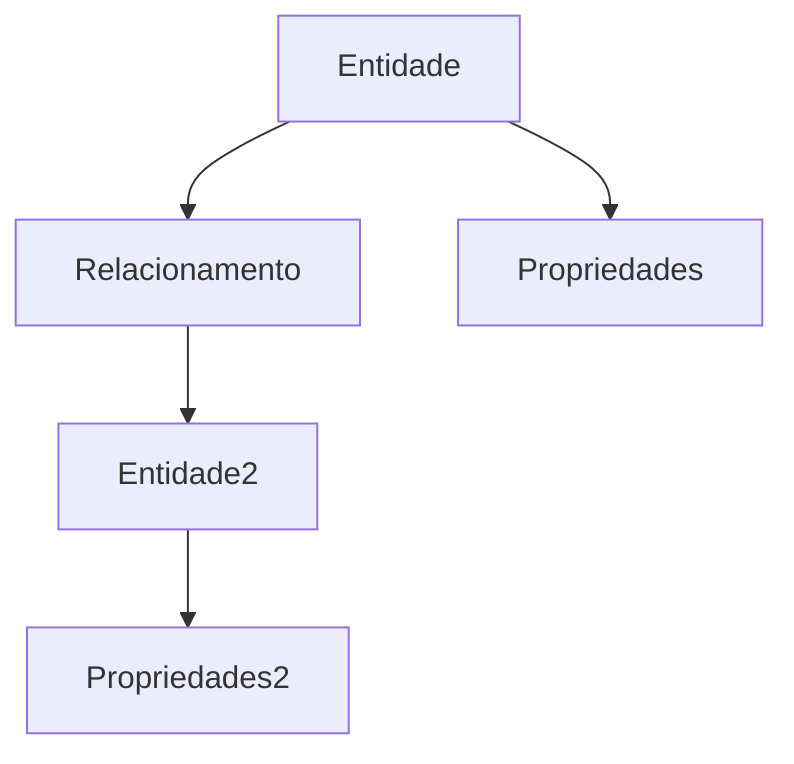

> [!abstract]
> Um **Knowledge Graph** representa conhecimento estruturado por meio de entidades, propriedades e relacionamentos.

## Conceito

O objetivo de um Knowledge Graph é modelar conhecimento de maneira semântica.

Em vez de armazenar apenas documentos, ele representa fatos conectados entre si.

Essas conexões permitem que sistemas descubram relações entre conceitos e realizem consultas muito mais inteligentes.

## Estrutura

## Componentes

- Entidades
- Relacionamentos
- Propriedades
- Tipos
- Ontologias

## Características

- Conhecimento relativamente permanente
- Estrutura semântica
- Alto grau de reutilização
- Compartilhado entre aplicações

> [!important]
> O Knowledge Graph representa **o que sabemos sobre um domínio**, não o estado atual de uma execução.

## Diferença para Context Graph

| Knowledge Graph | Context Graph |
|-----------------|---------------|
| Conhecimento permanente | Estado atual |
| Relativamente estável | Dinâmico |
| Compartilhado | Específico da execução |
| Modela o domínio | Modela o contexto |

## Papel na IA Generativa

Arquiteturas modernas utilizam Knowledge Graph para:

- enriquecer RAG
- apoiar agentes
- representar ontologias
- fornecer contexto estruturado ao LLM

## Veja também

- [[Context Graph]]
- [[Retrieval-Augmented Generation (RAG)]]
- [[Large Language Model (LLM)]]
- [[Model Context Protocol (MCP)]]