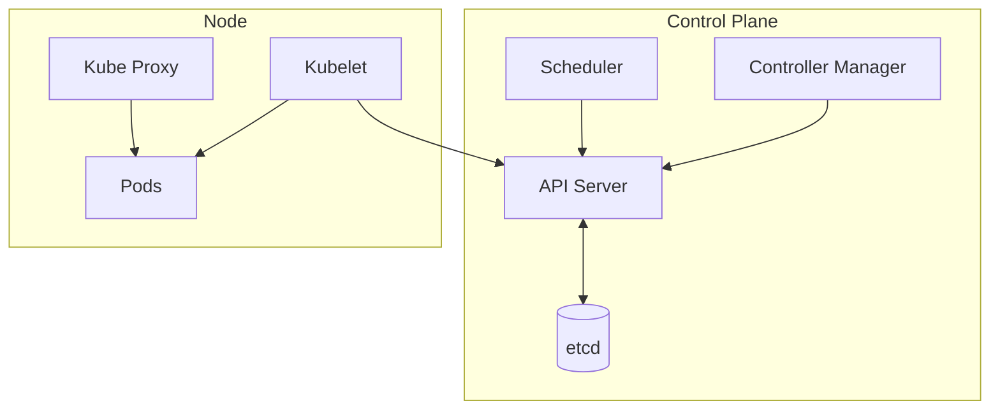

> [!abstract]
> Kubernetes é a plataforma de [[Container Orchestration]] que gerencia a implantação, escala e operação de aplicações containerizadas em um cluster, herdando o desenho do sistema interno Borg do Google.

## Conceito

O nome abreviado — K8s, com os oito caracteres entre K e s — virou o apelido. O modelo é declarativo do começo ao fim: nada é "executado", tudo é **declarado**, e o cluster trabalha continuamente para que a realidade coincida com a declaração.

Um cluster tem duas metades: o **control plane**, que decide, e os **nodes**, que executam. Em produção o control plane roda distribuído em várias máquinas, porque ele é a condição de existência de todo o resto.

## Arquitetura

| Componente | Papel |
|---|---|
| **API Server** | Fala com todos os componentes; toda operação passa por ele |
| **Scheduler** | Observa Pods sem nó atribuído e decide onde cada um roda |
| **Controller Manager** | Executa os controladores (Node, Job, EndpointSlice, ServiceAccount) que fazem a reconciliação |
| **etcd** | Key-value store que guarda todo o estado do cluster |
| **Pod** | Menor unidade administrada: um grupo de contêineres com um único IP compartilhado |
| **Kubelet** | Agente em cada nó; garante que os contêineres do Pod estejam rodando |
| **Kube Proxy** | Proxy de rede em cada nó; roteia o tráfego do Service até o contêiner certo |

## Tipos de Service

O campo `type` define como a aplicação é exposta na rede:

| Tipo | Alcance |
|---|---|
| **ClusterIP** | Padrão. IP interno, acessível apenas dentro do cluster |
| **NodePort** | Abre uma porta em todos os nós — acesso via `NodeIP:NodePort` |
| **LoadBalancer** | Expõe externamente via balanceador do provedor de nuvem |
| **ExternalName** | Mapeia o Service para um nome DNS externo, tipicamente um banco fora do cluster |

## Características

- O Service resolve [[Service Discovery]] nativamente, via DNS interno do cluster
- Tolerância a falhas vem de rodar control plane e workloads distribuídos em múltiplos nós
- O ecossistema em volta cobre segurança, rede, runtime, gestão de cluster, [[Observability]] e provisionamento de infraestrutura

## Veja também

- [[Container Orchestration]]
- [[Container]]
- [[Cloud Native]]
- [[Service Mesh]]
- [[Service Discovery]]
- [[Microservices]]
- [[Platform Engineering]]
