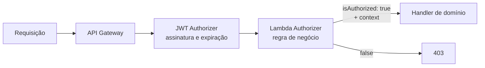

> [!abstract]
> Lambda Authorizer é uma função invocada pelo API Gateway antes do handler de negócio, que decide se a requisição prossegue e devolve à cadeia um contexto de autorização já resolvido e confiável.

## Conceito

O JWT Authorizer nativo responde a uma pergunta só: *este token é autêntico e está válido?* Quando a decisão depende de algo que a assinatura não prova — se o tenant declarado é mesmo o do usuário, se a assinatura está ativa, se o plano cobre aquela rota — é preciso código. O Lambda Authorizer é esse código, executado **na borda**, antes de qualquer handler existir.

O ganho não é só segurança: é **eliminar repetição**. Sem ele, cada handler reimplementaria a mesma verificação, e a que faltasse em um deles seria a brecha.

## Simple response × IAM policy

| Modo | Retorna | Quando usar |
|---|---|---|
| **Simple** | `{ isAuthorized: boolean, context: {...} }` | Padrão em HTTP API — legível e suficiente |
| **IAM policy** | Documento de política com `Allow`/`Deny` por ARN de método | REST API, ou quando a permissão varia rota a rota dentro da mesma chamada |

O campo `context` é o que faz a diferença arquitetural: o autorizador resolve uma vez `tenantId`, `userId` e papéis, e todos os handlers os leem de `event.requestContext.authorizer` como **dado confiável**, sem reparsear o token.

## Cache

A resposta pode ser cacheada por uma chave de identidade (tipicamente o token) durante um TTL configurável. Isso reduz drasticamente o custo e a latência — e cria a armadilha correspondente:

> [!warning] Cache guarda a decisão, não a mudança
> Se a chave de cache for só o token, e o usuário trocar de tenant no mesmo token, a decisão antiga é reaproveitada. A chave precisa incluir **tudo que a decisão consultou** — token *e* o cabeçalho do tenant. TTL de autorização deve ser curto: revogação de acesso só tem efeito depois que ele expira.

## Boas práticas

- O autorizador é caminho crítico de **toda** requisição: mantenha-o mínimo, sem consulta pesada ao banco. Se precisar de dados, prefira o que já está no token — ver [[Token Enrichment (Custom Claims)]]
- Nunca logue o token; logue o `sub` e a decisão
- Falhar fechado: qualquer exceção resulta em negação, nunca em passagem
- Cuidado ao mesclar autenticação e autorização: a validação criptográfica cabe ao JWT Authorizer nativo, que é gratuito e mais rápido

## Veja também

- [[Amazon API Gateway]]
- [[Amazon Cognito]]
- [[Token Enrichment (Custom Claims)]]
- [[Multi-Tenancy]]
- [[Authorization]]
- [[Segurança de API]]
