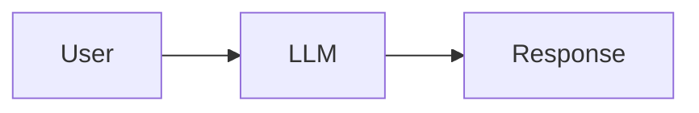

> [!abstract]
> Um **Large Language Model (LLM)** é um modelo de inteligência artificial treinado sobre grandes volumes de texto para compreender linguagem natural, realizar inferências e gerar respostas.

## Conceito

O LLM é o **motor de raciocínio** de uma arquitetura de IA Generativa.

Sua principal responsabilidade é interpretar instruções, compreender contexto, produzir respostas e decidir quais ações devem ser executadas.

Embora seja extremamente capaz, o modelo possui limitações importantes:

- conhecimento limitado ao treinamento
- ausência de acesso nativo a sistemas externos
- memória limitada ao contexto recebido
- possibilidade de gerar informações incorretas (alucinações)

Por esse motivo, arquiteturas modernas complementam o LLM com outros componentes como [[Retrieval-Augmented Generation (RAG)]], [[Knowledge Graph]], [[Context Graph]] e [[Model Context Protocol (MCP)]].

## Papel na Arquitetura

## Características

- Compreensão de linguagem natural
- Geração de texto
- Inferência
- Planejamento
- Uso de ferramentas
- Síntese de conhecimento

> [!note]
> O LLM é responsável pelo **raciocínio**, mas não representa toda a arquitetura de IA.

## Veja também

- [[Retrieval-Augmented Generation (RAG)]]
- [[Knowledge Graph]]
- [[Context Graph]]
- [[Model Context Protocol (MCP)]]
- [[Context Window]]
- [[Extended Thinking]]
- [[Constitutional AI]]
