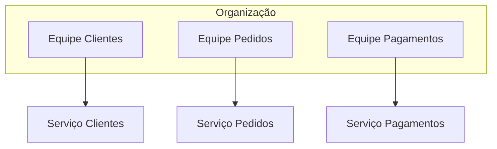

> [!quote]
> **"Organizações projetam sistemas que refletem sua estrutura de comunicação."**
>
> — Melvin Conway (1967)

> [!info] O que significa?
> A arquitetura de um sistema tende a espelhar a forma como as equipes estão organizadas e se comunicam. Se a comunicação entre equipes é fragmentada, o software também tende a apresentar fronteiras e dependências semelhantes.

## Como funciona

## Exemplo

> [!success] Quando aplicada corretamente
> Equipes alinhadas aos domínios de negócio tendem a produzir sistemas mais coesos, desacoplados e fáceis de evoluir.

> [!warning] Atenção
> Migrar um monólito para microsserviços sem mudar a forma como as equipes trabalham normalmente resulta em um **monólito distribuído**.

## Conceitos relacionados

- [[Domain-Driven Design]]
- [[Bounded Context]]
- [[Microsserviços]]
- [[Team Topologies]]
- [[Arquitetura Evolutiva]]
- [[Reverse Conway Maneuver]]