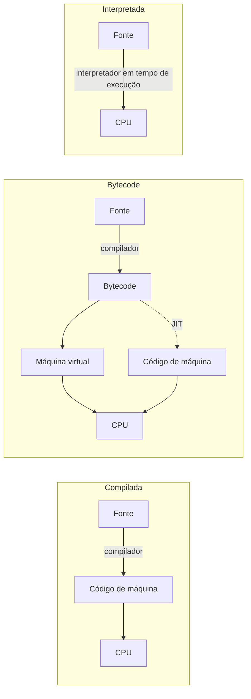

> [!abstract]
> As linguagens se distinguem por **quando** o código-fonte vira instrução executável: antes de rodar, durante a execução, ou em duas etapas.

## Conceito

Toda linguagem precisa, em algum momento, transformar texto em algo que o processador execute. A diferença entre as famílias é **onde esse momento cai** — e essa escolha determina desempenho, portabilidade e ciclo de desenvolvimento.

| Família | Como funciona | Exemplos |
|---|---|---|
| **Compilada** | O compilador gera código de máquina, executado diretamente pela CPU | C, C++, Go, Rust |
| **Bytecode** | O fonte vira bytecode; a máquina virtual o executa. O JIT pode compilar trechos quentes para código de máquina e acelerar | Java, C# |
| **Interpretada** | Não há compilação: o interpretador lê e executa em tempo de execução | Python, JavaScript, Ruby |

Em geral, **linguagens compiladas rodam mais rápido** que interpretadas.

## O trade-off

| | Compilada | Interpretada |
|---|---|---|
| Velocidade de execução | Alta | Menor |
| Ciclo editar-testar | Mais lento — recompilar | Imediato |
| Erros de tipo | Pegos em compilação | Só em execução |
| Portabilidade do artefato | Um binário por plataforma | O mesmo fonte em toda parte |

> [!important] Onde isto encosta em arquitetura
> A família da linguagem muda o que o [[Pipeline de CI-CD]] precisa fazer e o que o [[Container]] precisa carregar. Linguagem compilada produz um binário estático que cabe em uma imagem mínima; linguagem interpretada exige o interpretador e as dependências dentro da imagem — o que alimenta o anti-padrão de imagens infladas descrito em [[Cloud Native Anti-Patterns]].

> [!warning]
> A classificação é da **implementação**, não da linguagem. Existe Python compilado e C interpretado. "Python é interpretado" significa "a implementação de referência do Python interpreta".

## Fonte

- ByteByteGo, *How Do C++, Java, Python Work?* — BIG ARCHIVE: System Design 2023

## Veja também

- [[Container]]
- [[Pipeline de CI-CD]]
- [[Cloud Native Anti-Patterns]]
- [[Estruturas de Dados]]
- [[System Design MOC]]
