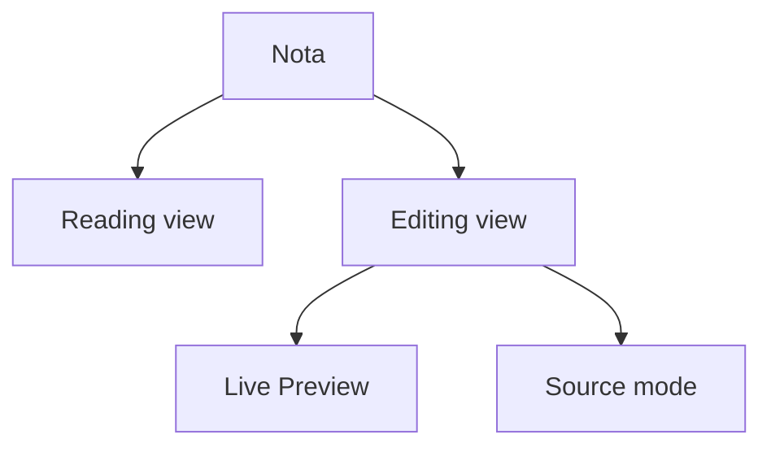

> [!abstract]
> **Live Preview** é o editing mode que exibe o texto já formatado inline enquanto esconde a maior parte da sintaxe Markdown, revelando-a apenas onde o cursor está.

## Conceito

O Obsidian separa dois eixos que a maioria dos editores confunde em um só botão:

- **Views** alternam entre **ler** e **editar** a nota — *Reading view* e *Editing view*
- **Modes** controlam **como o Markdown aparece enquanto você edita** — *Live Preview* e *Source mode*

Ou seja, Live Preview e Source mode são subdivisões da Editing view, não alternativas à Reading view. A Reading view mostra a nota sem sintaxe alguma, em formato limpo para leitura focada; a Source mode exibe toda a sintaxe exatamente como escrita, para quem prefere texto puro ou precisa de controle preciso de formatação.

Live Preview é o meio-termo: formata inline e, quando o cursor entra no conteúdo formatado, a sintaxe subjacente reaparece para edição. A doc chega a afirmar que *in many cases, Live Preview can eliminate the need to switch to Reading view*.

## Como alternar

- **`Ctrl+E`** (`Cmd+E` no macOS) alterna entre Reading view e Editing view
- O **view switcher** no canto superior direito do editor — exige **Settings → Appearance → Show tab title bar** ativo
- O **ícone interativo na status bar** — exige **Settings → Editor → Show editing mode in status bar**
- O comando **Toggle Reading view** pela command palette
- Para trocar entre Live Preview e Source mode rapidamente, defina uma hotkey para o comando **Toggle Live Preview/Source mode** — ele não vem com atalho atribuído
- **Lado a lado**: segure `Ctrl` (`Cmd` no macOS) e clique no view switcher para abrir a mesma nota em Editing e Reading view ao mesmo tempo

## Configuração padrão

- **Settings → Editor → Default view for new tabs**: Reading view ou Editing view (por padrão, novas abas abrem em editing)
- **Settings → Editor → Default editing mode**: Live Preview (padrão) ou Source mode

> [!important] Recursos que dependem do modo
> Algumas capacidades só existem em um dos modos, e isso explica boa parte dos "não funciona aqui":
> - **Inline footnotes** (`^[texto]`) só funcionam em **Reading view**, não em Live Preview
> - **Comentários** `%%texto%%` só são visíveis em **Editing view**
> - **Nested properties** só podem ser vistas em **Source mode** — ver [[Properties (Frontmatter)]]
> - **PrismJS** não é suportado em Source mode nem em Live Preview: o syntax highlighting de code blocks pode ser renderizado de forma diferente fora da Reading view

## Comparação

| | Source mode | Live Preview | Reading view |
|---|---|---|---|
| Eixo | Editing mode | Editing mode | View |
| Sintaxe Markdown | Toda visível | Oculta, revelada sob o cursor | Nenhuma visível |
| Edita a nota | Sim | Sim | Não |
| Comentários `%%` | Visíveis | Visíveis | Ocultos |
| Inline footnotes | Não renderizam | Não renderizam | Renderizam |
| Nested properties | Visíveis | Não | Não |
| PrismJS | Não | Não | Sim |

## Veja também

- [[Obsidian Flavored Markdown (OFM)]]
- [[Callout]]
- [[Properties (Frontmatter)]]
- [[Workspace Layout]]
