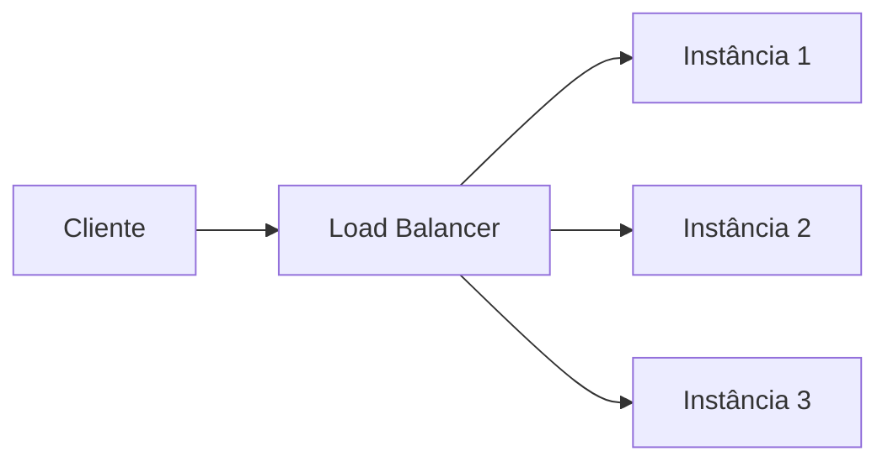

> [!abstract]
> Load Balancer é o componente que distribui requisições entre várias instâncias de um mesmo serviço, transformando um conjunto de máquinas em um único endereço lógico.

## Conceito

Um balanceador resolve dois problemas de uma vez: **capacidade**, porque a carga é dividida, e **disponibilidade**, porque uma instância que cai deixa de receber tráfego. O que distingue um balanceador de outro é o algoritmo — e a divisão que importa é entre algoritmos que ignoram o estado dos destinos e algoritmos que o observam.

## Algoritmos

**Estáticos** — a decisão não depende do estado atual das instâncias:

| Algoritmo | Regra |
|---|---|
| **Round robin** | Distribui em ordem sequencial. Exige serviços *stateless* |
| **Sticky round-robin** | Mantém o mesmo cliente na mesma instância entre requisições |
| **Weighted round-robin** | Peso por instância — máquinas maiores recebem mais tráfego |
| **Hash** | Aplica uma função hash ao IP ou à URL e roteia pelo resultado |

**Dinâmicos** — a decisão depende de métricas coletadas em tempo real:

| Algoritmo | Regra |
|---|---|
| **Least connections** | Envia para a instância com menos conexões concorrentes |
| **Least response time** | Envia para a instância que está respondendo mais rápido |

## Comparação

| | Estáticos | Dinâmicos |
|---|---|---|
| Custo de decisão | Desprezível | Exige coletar e manter estado |
| Reação a instância degradada | Nenhuma | Imediata |
| Requisito sobre o serviço | Stateless (exceto sticky) | Indiferente |

> [!important] Sticky sessions não são de graça
> Prender o cliente a uma instância resolve estado local, mas quebra a premissa que torna round-robin eficaz e transforma a queda de um nó em perda de sessão. Estado compartilhado em [[Distributed Cache]] costuma ser a saída melhor.

## Veja também

- [[Reverse Proxy]]
- [[Modelo OSI]]

- [[API Gateway]]
- [[DNS Routing Policy]]
- [[Content Delivery Network (CDN)]]
- [[Microservices]]
- [[Service Mesh]]
- [[High Availability]]
