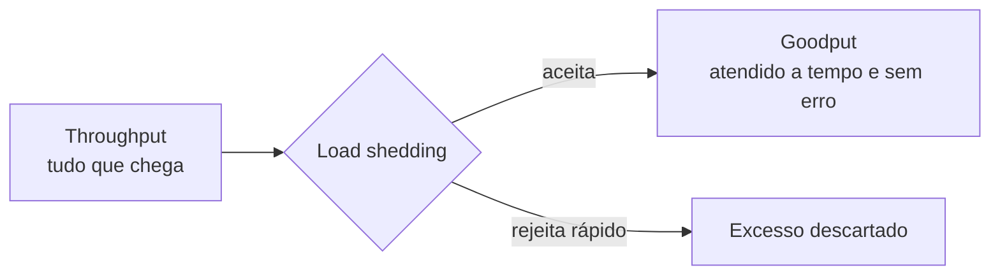

> [!abstract]
> Load shedding é **rejeitar deliberadamente o excesso de requisições** quando o servidor se aproxima da sobrecarga, para manter a latência baixa nas que ele decidiu aceitar.

## Conceito

Sistemas ficam mais lentos conforme recebem mais trabalho concorrente — contenção de thread, troca de contexto, coleta de lixo e disputa de I/O se acentuam. Em algum ponto, o desempenho degrada **mais rápido** do que a carga cresce. É a Lei Universal da Escalabilidade em ação: o ganho por paralelização é limitado pelos pontos de serialização.

Quando a latência do servidor ultrapassa o [[Timeout]] do cliente, o problema **deixa de ser de latência e vira de disponibilidade**.

## Throughput × goodput

- **Throughput** — total de requisições por segundo enviadas ao servidor
- **Goodput** — o subconjunto atendido sem erro e com latência baixa o bastante para o cliente **aproveitar** a resposta

Sem shedding, o goodput despenca a zero conforme a carga sobe. Com shedding, ele estabiliza em um platô: o servidor mantém alta disponibilidade para o que aceitou, e só o excedente é afetado.

## O ciclo de retroalimentação

> [!warning] Sobrecarga se amplifica sozinha
> Quando o cliente sofre timeout, **todo o trabalho já feito pelo servidor é desperdiçado** — e a última coisa que um sistema com capacidade escassa deveria fazer é desperdiçar trabalho. Pior: o cliente costuma retentar, multiplicando a carga. Em uma cadeia de serviços profunda, com retentativas em cada camada, o efeito é **exponencial**.
>
> Sem intervenção, a sobrecarga vira estado estacionário. Ver [[Retry Pattern]].

## Mecanismos

| Mecanismo | Como funciona |
|---|---|
| **Priorizar requisições** | O *ping* do balanceador é a mais importante: sem resposta, a instância sai do pool e a frota encolhe durante a crise |
| **Prazo por requisição** | O cliente envia quanto tempo está disposto a esperar; o servidor descarta o que já não tem salvação |
| **Vigiar as filas** | Limitar não só o tamanho, mas **quanto tempo** a requisição espera na fila. Descartar o que ficou velho demais |
| **Trabalho limitado** | APIs paginadas dão ao servidor um teto previsível de memória, CPU e rede por requisição |
| **Proteger em camadas** | Balanceador, `iptables`, WAF e gateway descartam antes, mais barato — ao custo de menos visibilidade |

> [!tip] Rejeitar tem que ser barato
> Se descartar custa quase o mesmo que atender, o shedding não resolve nada. Um `log` acidental ou uma configuração de socket podem tornar a rejeição muito mais cara do que precisa ser. É por isso que se testa **muito além** do ponto de ruptura.

> [!warning] Duas armadilhas de configuração
> **Anular a autoescala:** se o shedding e a escala reativa miram o mesmo alvo de CPU, o shedding segura a CPU baixa e o sinal para subir instâncias nunca chega.
>
> **Poluir a métrica de latência:** um serviço que descarta 60% do tráfego exibe latência mediana ótima, porque as falhas rápidas puxam a média para baixo.

## Fonte

- David Yanacek, [Using load shedding to avoid overload](https://aws.amazon.com/builders-library/using-load-shedding-to-avoid-overload/), Amazon Builders' Library

## Veja também

- [[Rate Limiting]]
- [[Timeout]]
- [[Retry Pattern]]
- [[Circuit Breaker]]
- [[Bulkhead]]
- [[Chaos Engineering]]
- [[System Design MOC]]
