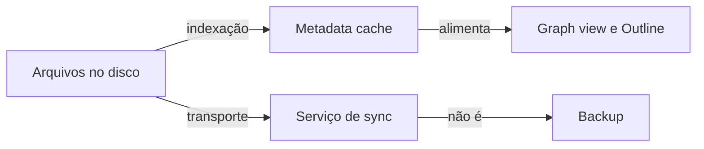

> [!abstract]
> **Local-first** é o princípio de arquitetura em que os dados vivem primariamente como arquivos de texto simples no disco do usuário, e a nuvem entra apenas como utilidade de transporte — nunca como armazenamento canônico.

## Conceito

O Obsidian é, antes de tudo, um editor de arquivos: as notas são arquivos Markdown de texto simples dentro de um [[Vault]]. Não existe um "documento no servidor" do qual o arquivo seja uma cópia — a relação é invertida. A sincronização existe para facilitar o trabalho em vários dispositivos, não para guardar o dado.

> [!quote]
> Sync is only a utility to facilitate working on multiple devices, the data will always primarily live on your hard disk.

A consequência prática é liberdade de ferramenta: quando o sistema de arquivos substitui a nuvem, qualquer coisa que funcione sobre arquivos funciona sobre a sua base de conhecimento — backup por Dropbox, versionamento por Git, criptografia de disco. É o oposto do [[Vendor Lock-in]]: o formato não-proprietário garante [[Data Portability]], permitindo usar o Obsidian offline e trocar de aplicativo se um dia for necessário.

> [!quote]
> By writing your notes in plain text, they'll outlive any app—even Obsidian itself.

## Estado canônico × estado derivado

A arquitetura separa com nitidez o que é dado do que é índice. Os arquivos do vault são o estado canônico; o [[Metadata Cache]] em IndexedDB é estado derivado, descartável e reconstruível. Perder o cache custa uma reindexação; perder os arquivos custa o conhecimento.

## Características

- Formato não-proprietário: Markdown puro, legível por qualquer editor
- Mudanças externas ao app são detectadas e refletidas no vault
- Funciona offline por desenho — a rede é opcional
- O usuário mantém controle total sobre onde o dado reside

> [!warning] Sync não é backup
> A doc é explícita: Obsidian Sync, iCloud, OneDrive e Dropbox mantêm os arquivos iguais em todos os dispositivos, mas **não são projetados para backup**. Serviços de sync não têm dispositivo "primário"; um [[Backup]] é uma cópia unidirecional em outro lugar. Como o dado é local, corrupção e perda são questão de *quando*, não de *se* — e a responsabilidade da cópia de segurança passa a ser sua.

## Comparação

| | Local-first | Cloud-first |
|---|---|---|
| Fonte de verdade | Arquivo no disco | Registro no servidor |
| Papel do sync | Utilidade de transporte | Armazenamento canônico |
| Offline | Modo normal de operação | Modo degradado |
| Saída do produto | Copiar a pasta | Exportação mediada |
| Backup | Responsabilidade do usuário | Delegado ao fornecedor |

## Veja também

- [[Vault]]
- [[Metadata Cache]]
- [[Data Portability]]
- [[Vendor Lock-in]]
- [[Backup]]
- [[File Recovery]]
