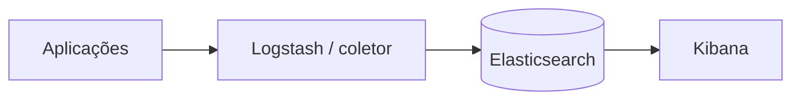

> [!abstract]
> Logging é o registro de eventos discretos ocorridos no sistema — cada requisição recebida, cada acesso ao banco, cada exceção — formando o pilar de maior volume da [[Observability]].

## Conceito

O log responde à pergunta "**o que aconteceu exatamente aqui?**". É o pilar mais detalhado e, por isso, o mais caro em volume: cada evento gera uma linha, e um sistema movimentado gera milhões delas por hora.

Esse volume é o que torna o **formato padronizado** um requisito e não um refinamento. Sem convenção comum entre os times, buscar por palavra-chave em bilhões de linhas heterogêneas deixa de funcionar exatamente quando é mais necessário: durante um incidente.

O stack ELK — Elastic, Logstash, Kibana — é a montagem clássica de uma plataforma de análise de logs.

## Características

- **Discreto e não agregado**: cada evento existe por si, ao contrário de métricas
- **Maior volume dos três pilares**, com o maior custo de armazenamento e indexação
- Precisa de formato padronizado e estruturado (idealmente JSON) para ser pesquisável
- Precisa de correlação — um ID de requisição propagado é o que liga o log ao [[Distributed Tracing]]

> [!warning]
> Log em disco local dentro do contêiner desaparece com ele. Em ambiente efêmero, o log precisa ser enviado para fora da instância no momento em que é gerado — é uma das exigências de [[Immutable Infrastructure]].

## Comparação

| Pilar | Pergunta que responde | Volume |
|---|---|---|
| **Logging** | O que aconteceu neste ponto? | Alto |
| **Distributed Tracing** | Por onde passou esta requisição? | Médio |
| **Métricas** | Como está a tendência agregada? | Baixo |

## Veja também

- [[Observability]]
- [[Distributed Tracing]]
- [[Monitoring and Event Management]]
- [[Site Reliability Engineering (SRE)]]
- [[Microservices]]
