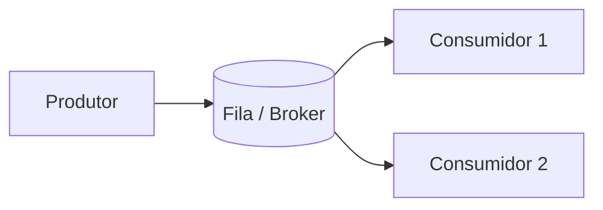

> [!abstract]
> Message Queue é um intermediário que recebe mensagens de produtores e as entrega a consumidores, desacoplando os dois no tempo e na disponibilidade.

## Conceito

Sem fila, produtor e consumidor precisam estar de pé ao mesmo tempo e no mesmo ritmo. Com fila, o produtor entrega e segue; o consumidor processa quando puder. Esse desacoplamento é o que permite absorver picos, tolerar a queda temporária de um consumidor e escalar os dois lados de forma independente.

## Evolução das arquiteturas

| Produto | Origem | Modelo |
|---|---|---|
| **IBM MQ** (1993) | IBM | Enfileiramento corporativo, forte no setor financeiro |
| **RabbitMQ** | Open source | Produtor publica em um *exchange* (direct, topic ou fanout) que roteia para as filas por atributos da mensagem |
| **Kafka** (2011) | LinkedIn | Log de eventos distribuído e particionado — ver [[Event Streaming Platform]] |
| **Pulsar** | Yahoo | Camadas de serving e persistência separadas, armazenamento em camadas sobre object storage |

A linha do tempo mostra um deslocamento: de **entregar mensagens** (o broker esquece depois do ack) para **reter um log de eventos** (o broker é a fonte da verdade), e daí para arquiteturas nativamente elásticas.

## Critérios de seleção

- **Velocidade** — throughput e latência de ponta a ponta
- **Escalabilidade** — comportamento sob crescimento de volume e de consumidores
- **Confiabilidade** — garantias de entrega e de não perda
- **Durabilidade** — por quanto tempo a mensagem sobrevive
- **Facilidade de operação** — custo real do dia a dia
- **Ecossistema e integração** — ferramentas, conectores e clientes disponíveis
- **Suporte a protocolos** — AMQP, MQTT, Kafka protocol

> [!warning]
> A fila não faz o problema desaparecer, ela o move: agora existem ordenação, idempotência, *dead letter queue* e *backlog* para gerenciar. Consumidor que não é idempotente quebra na primeira reentrega.

## Veja também

- [[Event Streaming Platform]]
- [[Event Sourcing]]
- [[Microservices]]
- [[Circuit Breaker]]
- [[Object Storage]]
