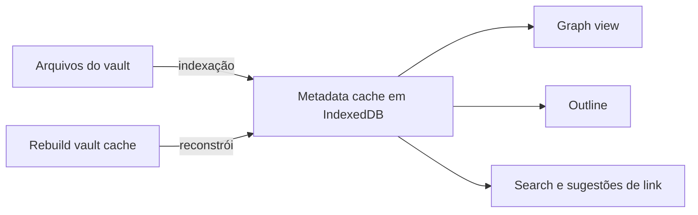

> [!abstract]
> O **metadata cache** é o registro local de metadados sobre os arquivos do [[Vault]] que o Obsidian mantém para oferecer uma experiência rápida — um índice derivado, persistido em IndexedDB.

## Conceito

Ler e parsear milhares de arquivos Markdown a cada interação seria inviável. O Obsidian resolve isso mantendo um registro local de metadados sobre os arquivos do vault, e é esse registro que alimenta boa parte do app — a doc cita da [[Graph View|Graph view]] à Outline view. Estruturas construídas sobre metadados, como [[Properties (Frontmatter)|properties]] e [[Tag (Obsidian)|tags]], dependem dele para responder rápido.

Esse índice vive no **IndexedDB**, um banco client-side de baixo nível que o Obsidian usa como armazenamento de backend. Ele também mantém o estado das conexões do [[Obsidian Sync]] e preserva o metadata cache quando o aplicativo é fechado.

A leitura arquitetural importa mais do que o mecanismo: o cache é **estado derivado e descartável**. Os arquivos do vault são a única fonte de verdade — coerente com o [[Local-first]]. Perder o índice custa tempo de reindexação; nenhuma nota é perdida com ele. É a mesma separação entre modelo de escrita e modelo de leitura que o [[CQRS]] formaliza: o lado de leitura pode ser reconstruído inteiro a partir do lado de escrita.

## Características

- Persistido em IndexedDB, sobrevivendo ao fechamento do aplicativo
- Alimenta múltiplas visões: a doc cita explicitamente Graph view e Outline view
- Mantido em sincronia com os arquivos, mas **pode dessincronizar** do conteúdo real
- Reconstruível em **Settings → Files and links → Rebuild vault cache**; a reconstrução leva de alguns segundos a alguns minutos, conforme o tamanho do vault
- Nenhuma informação exclusiva vive nele: tudo é recalculável a partir dos arquivos

> [!warning] Apple Lockdown Mode
> Se o Lockdown Mode da Apple estiver ativo e o Obsidian não estiver excluído da proteção, os arquivos do banco **não são salvos**, e o app precisa reindexar todo o vault a cada inicialização. É a mesma restrição que torna o [[File Recovery]] indisponível nesses dispositivos.

> [!tip] Quando reconstruir
> Sintomas típicos de cache dessincronizado são links que não aparecem no grafo, [[Backlink|backlinks]] ausentes ou resultados de busca defasados depois de edições feitas fora do Obsidian. Reconstruir é seguro: nenhum arquivo é tocado.

## Comparação

| | Arquivos do vault | Metadata cache |
|---|---|---|
| Natureza | Estado canônico | Estado derivado |
| Formato | Markdown em texto simples | IndexedDB, interno ao app |
| Onde vive | Dentro do vault | Global settings do dispositivo |
| Perda implica | Perda de conhecimento | Reindexação |
| Sincroniza entre dispositivos | Sim | Não — cada dispositivo indexa o seu |

## Veja também

- [[Local-first]]
- [[CQRS]]
- [[Graph View]]
- [[Vault]]
- [[Configuration Folder]]
