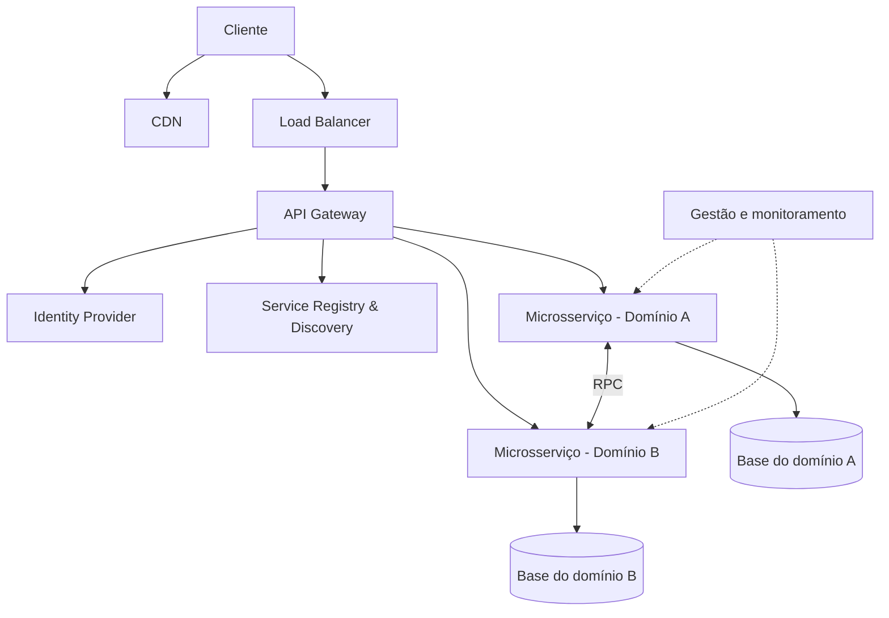

> [!abstract]
> Microservices é o estilo arquitetural em que o sistema é decomposto em serviços pequenos, alinhados a domínios de negócio, cada um com sua própria base de dados e seu próprio ciclo de implantação.

## Conceito

A decomposição em si é a parte fácil. O que define a arquitetura é a **independência**: se dois serviços precisam ser implantados juntos, ou compartilham a mesma base, o que existe é um monólito distribuído — com todo o custo operacional dos microsserviços e nenhum de seus benefícios.

A fronteira certa raramente é técnica. Ela segue o domínio (ver [[Domain Driven Design]]) e a estrutura dos times (ver [[Lei de Conway]]), porque é o time que precisa evoluir o serviço sem pedir licença a outro.

## Arquitetura típica

| Componente | Papel |
|---|---|
| [[Content Delivery Network (CDN)]] | Serve conteúdo estático perto do usuário |
| [[Load Balancer]] | Distribui o tráfego de entrada |
| [[API Gateway]] | Ponto único de entrada e políticas transversais |
| Identity Provider | Autenticação e autorização |
| [[Service Discovery]] | Registro e localização das instâncias |
| Gestão | [[Observability]] e operação dos serviços |

## Benefícios

- Serviços podem ser desenhados, implantados e escalados horizontalmente de forma independente
- Cada domínio é mantido por um time dedicado, sem coordenação de release
- Requisitos de negócio são atendidos de forma específica por domínio

## Custos

> [!warning]
> Cada chamada interna vira uma chamada de rede — ver [[Latency Numbers]]. Transação distribuída substitui o `COMMIT`, consistência vira eventual, e depurar exige [[Distributed Tracing]] porque nenhum log local conta a história inteira.

Os componentes de apoio no diagrama acima existem **apenas** porque o sistema foi decomposto. Esse é o preço de entrada, e ele é cobrado antes do primeiro benefício aparecer.

## Veja também

- [[API Gateway]]
- [[Service Discovery]]
- [[Service Mesh]]
- [[Container]]
- [[Kubernetes (K8s)]]
- [[Domain Driven Design]]
- [[Lei de Conway]]
- [[Circuit Breaker]]
