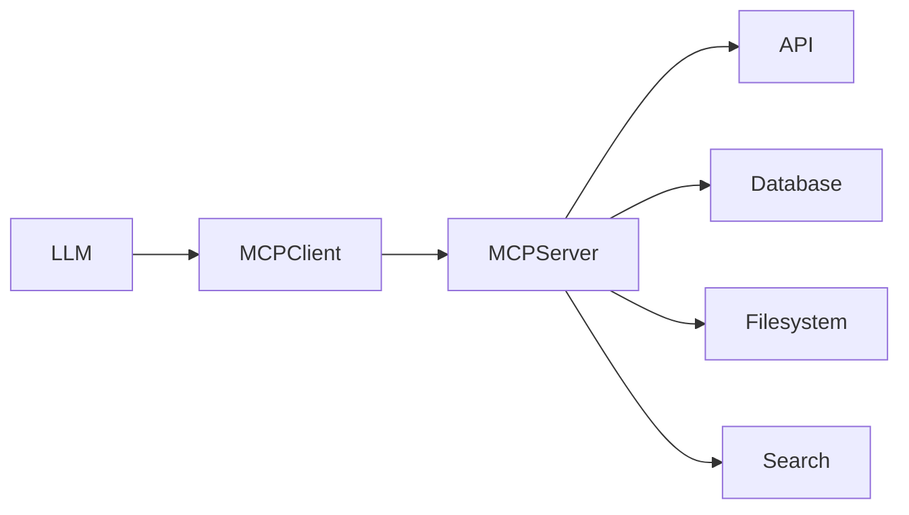

> [!abstract]
> O **Model Context Protocol (MCP)** é um protocolo aberto que padroniza a comunicação entre modelos de IA e recursos externos, como ferramentas, APIs, bancos de dados e sistemas corporativos.

## Conceito

O MCP define uma interface comum para que agentes possam descobrir, descrever e utilizar capacidades externas.

Seu objetivo é desacoplar os modelos de linguagem das implementações específicas de cada sistema.

Em vez de cada agente implementar integrações próprias, todos passam a utilizar um protocolo padronizado.

---

## Objetivos

- Padronizar integrações
- Compartilhar ferramentas
- Reduzir acoplamento
- Facilitar interoperabilidade
- Simplificar arquiteturas multiagentes

---

## Componentes

Uma arquitetura MCP normalmente possui:

- MCP Client
- MCP Server
- Ferramentas
- Recursos
- Prompts
- Modelos

---

## Fluxo Conceitual

---

## Benefícios

- Interface padronizada
- Reutilização de ferramentas
- Segurança centralizada
- Descoberta automática de capacidades
- Independência entre agentes e sistemas

---

## Papel em Arquiteturas de IA

O MCP fornece acesso padronizado para:

- APIs
- Sistemas corporativos
- Bancos de dados
- Repositórios
- Ferramentas locais
- Ferramentas remotas

Essas informações podem posteriormente alimentar o [[Context Graph]], que será utilizado pelo [[Large Language Model (LLM)]] durante o processo de raciocínio.

---

## Relação com o Context Graph

O MCP não representa o contexto.

Ele fornece mecanismos para recuperar informações que poderão compor o [[Context Graph]].

Pode-se dizer que:

- MCP conecta.
- Context Graph organiza.
- LLM raciocina.

---

## Papel em Arquiteturas Multiagentes

Em arquiteturas compostas por múltiplos agentes, um único servidor MCP pode disponibilizar ferramentas compartilhadas para todos os agentes da solução.

Isso reduz duplicação de integrações e simplifica a governança.

---

## Veja também

- [[Context Graph]]
- [[Large Language Model (LLM)]]
- [[Retrieval-Augmented Generation (RAG)]]
- [[Knowledge Graph]]
- [[Harness]]
- [[Agent Runtime]]
- [[Connector]]
- [[Agent Skill]]
- [[Claude Platform MOC]]
