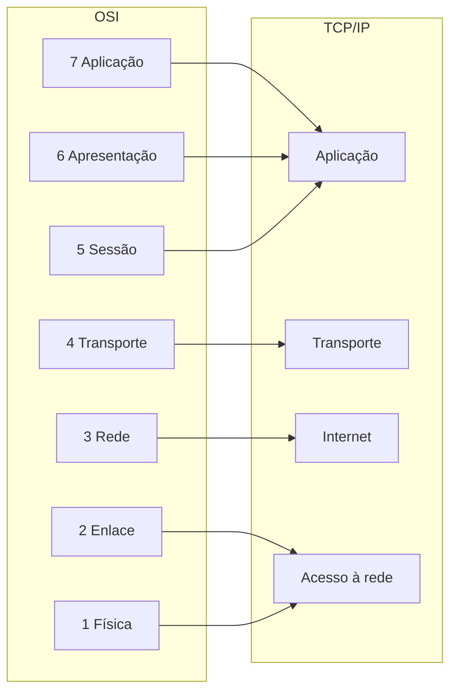

> [!abstract]
> O Modelo OSI descreve a comunicação em rede como **sete camadas**, cada uma responsável por um problema e conversando apenas com as camadas imediatamente acima e abaixo.

## Conceito

O valor do modelo não é descritivo, é **diagnóstico**. Quando algo não funciona em rede, a pergunta útil é "em que camada isto quebrou?" — e a resposta muda completamente o que investigar: cabo, roteamento, porta, certificado ou payload.

É o mesmo princípio de camadas que aparece como restrição em [[REST API]]: cada nível não enxerga além do vizinho, o que limita a complexidade total.

## As sete camadas

| # | Camada | Responsabilidade | Exemplo |
|--:|---|---|---|
| 7 | **Aplicação** | Protocolo que a aplicação fala | [[HTTP]], SMTP, FTP |
| 6 | **Apresentação** | Formato, codificação, cifragem | [[Transport Layer Security (TLS)]], JSON, gzip |
| 5 | **Sessão** | Estabelece e mantém a sessão | [[WebSocket]] após o upgrade |
| 4 | **Transporte** | Entrega fim a fim entre processos | [[TCP]], [[UDP]] |
| 3 | **Rede** | Endereçamento e roteamento entre redes | IP, [[CIDR]] |
| 2 | **Enlace** | Quadro entre nós adjacentes | Ethernet, MAC |
| 1 | **Física** | Sinal elétrico, óptico ou de rádio | Cabo, fibra, rádio |

## OSI × TCP/IP

O modelo OSI é **de referência**; a internet real roda sobre a pilha **TCP/IP**, que tem quatro camadas e nasceu antes da padronização:

> [!important] Encapsulamento é o mecanismo
> O dado desce a pilha ganhando um cabeçalho por camada e sobe do outro lado perdendo um por vez. É por isso que um [[Load Balancer]] de camada 4 só enxerga IP e porta, enquanto um de camada 7 lê a URL — cada um abriu até um nível diferente do envelope.

> [!warning]
> As camadas 5 e 6 quase não existem separadas na prática: TLS e serialização vivem dentro do que se chama "aplicação" no mundo TCP/IP. Tratar o OSI como descrição literal da internet leva a discussões sem saída.

## Fonte

- ISO/IEC, *7498-1 — Open Systems Interconnection: Basic Reference Model*, 1994
- ByteByteGo, *How is data sent over the internet?* — BIG ARCHIVE: System Design 2023

## Veja também

- [[TCP]]
- [[UDP]]
- [[HTTP]]
- [[CIDR]]
- [[Load Balancer]]
- [[Transport Layer Security (TLS)]]
- [[System Design MOC]]
