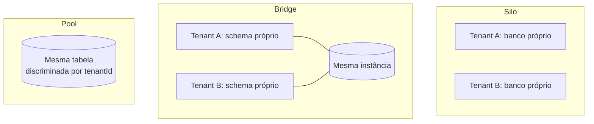

> [!abstract]
> Multi-tenancy é o modelo em que uma única instância da aplicação serve múltiplas organizações clientes (*tenants*), compartilhando infraestrutura enquanto mantém os dados de cada uma isolados das demais.

## Conceito

O tenant não é o usuário: é a **organização** a que o usuário pertence e que delimita o universo de dados visível para ele. Um mesmo usuário pode pertencer a mais de um tenant, e a troca entre eles é uma mudança de contexto, não um novo login.

O que torna o assunto crítico é a assimetria do risco. Toda a economia do SaaS vem do compartilhamento — uma infraestrutura, uma versão do código, um time de operação. E toda a confiança do produto depende de que esse compartilhamento **nunca vaze**. Um único caminho de código que esqueça o filtro de tenant é um incidente de vazamento de dados entre clientes.

## Modelos de isolamento

| Modelo | Isolamento | Custo por tenant | Onde se encaixa |
|---|---|---|---|
| **Silo** | Máximo — recurso dedicado | Alto, não amortiza | Cliente enterprise com exigência regulatória |
| **Bridge** | Intermediário | Médio | Transição entre os dois |
| **Pool** | Lógico, imposto por código e política | Mínimo | Padrão do SaaS de escala; obrigatório em serverless por conta dos limites de conta |

## Onde o isolamento é imposto

O erro comum é tratar isolamento como uma verificação. São **quatro camadas**, e todas precisam existir:

| Camada | Mecanismo | Falha se ausente |
|---|---|---|
| Token | `tenantId` como claim assinado — ver [[Token Enrichment (Custom Claims)]] | O cliente escolhe o próprio tenant |
| Borda | [[Lambda Authorizer]] compara o tenant declarado com o do token | Header forjado passa |
| Dados | Chave de partição prefixada por `TENANT#{id}` — ver [[Single-Table Design]] | Um bug de query lê tudo |
| Infraestrutura | Política IAM com condição sobre o prefixo da chave / *leading key* | Credencial vazada acessa todos |

> [!warning] Nunca leia o tenant de um cabeçalho HTTP no handler
> `X-Tenant-Id` enviado pelo cliente é *input*, não identidade. Ele serve para **declarar** qual contexto o usuário quer usar, e existe apenas para ser confrontado com o claim do token na borda. Dentro do handler, o tenant vem do contexto do autorizador — sempre.

## Efeitos colaterais que o modelo pool impõe

- **Ruído entre vizinhos**: um tenant pesado degrada os demais. Mitiga-se com concorrência reservada, cota por tenant e [[Rate Limiting]] por chave de tenant
- **Métrica por tenant** é requisito, não luxo: sem ela não há como precificar, nem como identificar o vizinho barulhento
- **Migração e exclusão** viram operações de dados, não de infraestrutura — apagar um tenant é varrer chaves, não derrubar um banco
- **Onboarding** deixa de ser provisionamento e passa a ser criação de registro

## Veja também

- [[Single-Table Design]]
- [[Token Enrichment (Custom Claims)]]
- [[Lambda Authorizer]]
- [[Amazon Cognito]]
- [[Autorização Multi-Tenant Fim a Fim]]
- [[Identity and Access Management (IAM)]]
