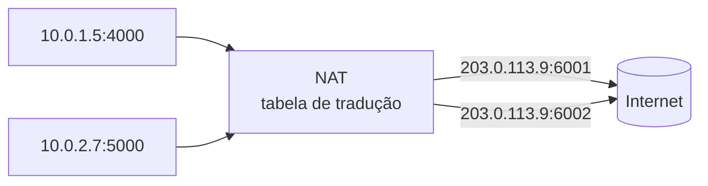

> [!abstract]
> NAT reescreve os endereços IP dos pacotes ao atravessarem a fronteira da rede, permitindo que muitos hosts com endereços privados compartilhem poucos endereços públicos.

## Conceito

O IPv4 tem cerca de 4 bilhões de endereços, insuficientes desde os anos 1990. O NAT adiou o esgotamento: dentro da rede, os hosts usam faixas privadas da RFC 1918; ao sair, o roteador substitui o endereço de origem pelo seu próprio e guarda a correspondência para saber a quem devolver a resposta.

## Consequências

| Efeito | Consequência prática |
|---|---|
| **Conserva endereços públicos** | Centenas de hosts atrás de um IP |
| **Esconde a topologia interna** | Efeito colateral de segurança, não é firewall |
| **Assimetria de conexão** | Quem está atrás do NAT **inicia** conexões, mas não recebe |
| **Quebra a conectividade fim a fim** | Protocolos que embutem IP no payload precisam de tratamento especial |
| **Exige estado no roteador** | A tabela de tradução é estado; se ela se perde, as conexões caem |

> [!important] É o que define subnet pública e privada
> Em nuvem, uma [[Subnet]] privada não tem rota para o Internet Gateway. Para que as instâncias ali consigam **sair** — buscar atualizações, chamar uma API externa — sem **receber** conexões, usa-se um NAT Gateway. Ver [[Virtual Private Cloud (VPC)]].

> [!warning]
> "Estamos atrás de NAT" não é uma medida de segurança. A assimetria dificulta conexões de entrada, mas não inspeciona conteúdo, não aplica política e não protege contra nada que a própria rede iniciou. Para isso existe [[Firewall]].

## Fonte

- IETF, [RFC 3022 — Traditional IP Network Address Translator](https://datatracker.ietf.org/doc/html/rfc3022), 2001

## Veja também

- [[Subnet]]
- [[Virtual Private Cloud (VPC)]]
- [[Firewall]]
- [[CIDR]]
- [[Modelo OSI]]
- [[System Design MOC]]
