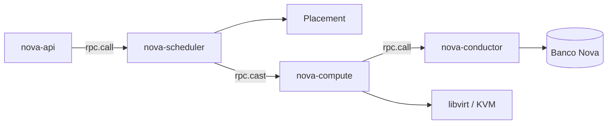

> [!abstract]
> Serviço de computação do OpenStack: gerencia todo o ciclo de vida das instâncias, do agendamento do host à criação no hipervisor.

## Conceito

É o cavalo de batalha do [[Infrastructure as a Service (IaaS)]]. Presente desde o primeiro release (Austin), acumulou funções ao longo dos anos e, com elas, complexidade — é o serviço mais intricado do núcleo.

Serviços de camada superior (bancos gerenciados, processamento de dados, catálogo de aplicações) são construídos **sobre** o Nova, não ao lado dele.

## Estrutura

| Componente | Onde roda | Papel |
|---|---|---|
| `nova-api` | Controller | Primeira interface; aceita a requisição HTTP e a encaminha pela fila |
| `nova-scheduler` | Controller | Escolhe o nó de computação por filtros e pesos |
| `nova-conductor` | Controller | Isola o compute do banco; operações de longa duração |
| `nova-compute` | Compute | Fala com o [[Hypervisor]] via Virt Driver → libvirt |
| `nova-novncproxy` | Controller | Acesso a console |

## Características

- **O conductor existe por segurança.** Antes dele, o `nova-compute` — rodando em host potencialmente comprometido — atualizava o banco diretamente. Isolá-lo reduz o raio de explosão.
- **Comunicação assíncrona por fila.** `rpc.call` espera resposta; `rpc.cast` é fire-and-forget. Ambos publicados no barramento AMQP.
- **Hipervisores suportados** hoje: KVM, QEMU, VMware, Hyper-V. Xen, XCP, UML e o driver Docker saíram do catálogo — este último virou o projeto [[Zun]].
- **Consoles:** noVNC, SPICE, serial, RDP (só Hyper-V) e MKM (vSphere).

## Veja também

- [[Placement]]
- [[Flavor]]
- [[Availability Zone]]
- [[Host Aggregate]]
- [[Nova Cells]]
- [[Hypervisor]]
