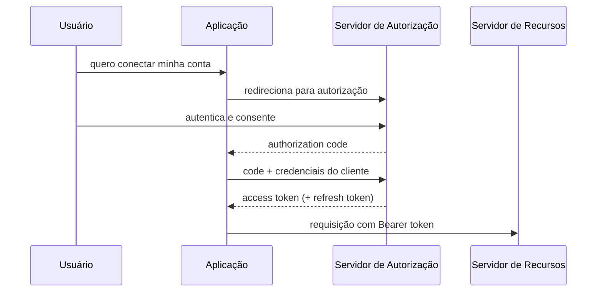

> [!abstract]
> OAuth 2.0 é o padrão da indústria para **autorização**: permite que uma aplicação acesse recursos do usuário em outro sistema sem jamais ver a senha dele.

## Conceito

Antes do OAuth, dar a um aplicativo acesso aos seus dados em outro serviço significava entregar usuário e senha — e com eles, acesso total e permanente. OAuth substitui a credencial por um **token**: escopo limitado, prazo limitado, revogável.

As entidades envolvidas são o **usuário** (resource owner), a **aplicação** (client), o **servidor de recursos** e o **servidor de autorização** / identity provider.

## O que o token permite

- **[[Single Sign-On (SSO)]]** — entrar em vários serviços com um login só
- **Autorização entre sistemas** — compartilhar direitos de acesso sem repetir o login
- **Acesso parcial ao perfil** — o app vê apenas o que o escopo autoriza, nunca tudo

## Fluxos

| Grant type | Status | Uso |
|---|---|---|
| **Authorization Code + PKCE** | ✅ Recomendado | O fluxo padrão, para web, mobile e SPA |
| **Client Credentials** | ✅ | Máquina para máquina, sem usuário envolvido |
| **Device Code** | ✅ | Dispositivos sem navegador ou teclado (TV, CLI) |
| **Refresh Token** | ✅ | Renovar o access token sem novo login |
| **Implicit** | ⚠️ **Legado** | Token devolvido direto ao cliente — desaconselhado |
| **Resource Owner Password** | ⚠️ **Legado** | O usuário entrega a senha ao cliente — anula o propósito do OAuth |

> [!warning] Material desatualizado circula muito
> Implicit Flow e Password Grant aparecem como opções legítimas em boa parte do conteúdo sobre OAuth, inclusive recente. A IETF os classifica como **legado**. Para clientes públicos — SPA e mobile — o correto é Authorization Code **com PKCE**, e a consolidação disso é o objetivo do OAuth 2.1.

> [!important] OAuth autoriza, não autentica
> OAuth 2.0 responde "esta aplicação pode fazer isto?", não "quem é este usuário?". Quem responde à segunda pergunta é o **OpenID Connect**, que é uma camada de identidade construída sobre OAuth 2.0. Confundir os dois é a origem de boa parte das implementações inseguras.

## Fonte

- IETF, [RFC 6749 — The OAuth 2.0 Authorization Framework](https://datatracker.ietf.org/doc/html/rfc6749)
- [oauth.net/2](https://oauth.net/2/) — mapa das extensões e do estado de cada grant type

## Veja também

- [[JSON Web Token (JWT)]]
- [[Single Sign-On (SSO)]]
- [[Identity Federation]]
- [[Gerenciamento de Sessão]]
- [[API Gateway]]
- [[Segurança de API]]
- [[System Design MOC]]
