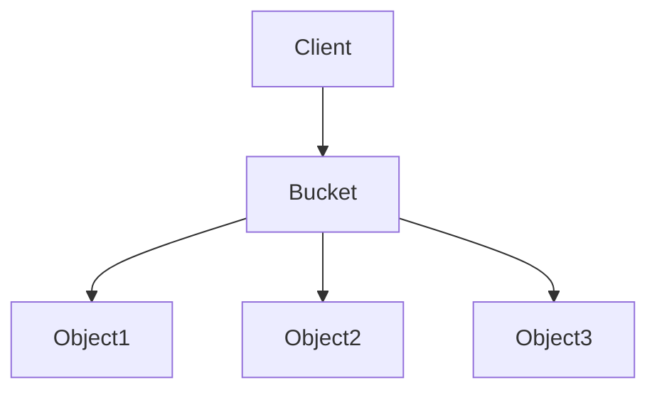

Object Storage é um modelo de armazenamento que organiza dados como **objetos**, em vez de arquivos ou blocos.

Cada objeto contém:

- Dados
- Metadados
- Identificador único (Object ID)

É altamente escalável e ideal para grandes volumes de dados não estruturados.

> [!info]
> O acesso normalmente ocorre via APIs HTTP (REST), e não através de sistemas de arquivos.

## Casos de uso

- Backup
- Data Lake
- Logs
- Imagens
- Vídeos
- Machine Learning

## Vantagens

- Escalabilidade praticamente ilimitada
- Alta durabilidade
- Replicação automática
- Baixo custo

## Limitações

- Maior latência que Block Storage
- Não indicado para bancos de dados transacionais

## Veja também

- [[Block Storage]]
- [[File Storage]]
- [[Data Lake]]