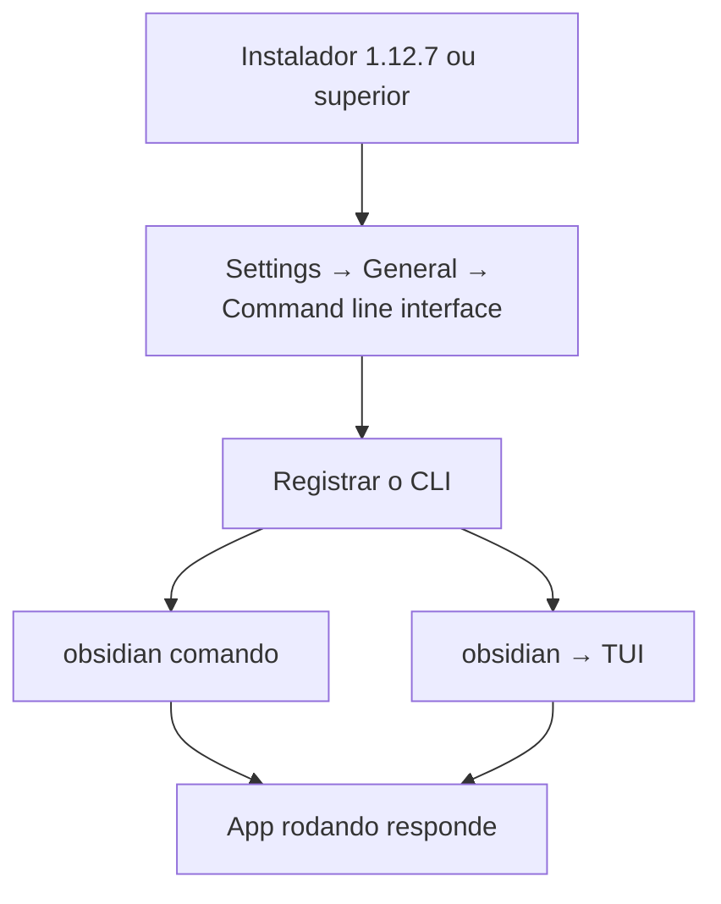

> [!abstract]
> **Obsidian CLI** é a interface de linha de comando que controla o app Obsidian a partir do terminal, para scripting, automação e integração com ferramentas externas.

## Conceito

A tese do CLI está na primeira linha da doc, e ela é ambiciosa:

> [!quote]
> "Anything you can do in Obsidian you can do from the command line."

Isso desloca o Obsidian de aplicativo para superfície programável. O ponto importante é que o CLI **não é um cliente independente**: ele se conecta à instância do Obsidian que está rodando. Se o app estiver fechado, o primeiro comando o inicia. Toda a resolução de links, o [[Metadata Cache|cache de metadados]] e o estado dos plugins vêm do app vivo — por isso `file=` resolve como um wikilink resolveria.

O CLI também é a razão pela qual o Obsidian se tornou endereçável por agentes. Os developer commands existem, segundo a própria doc, para que **ferramentas de codificação agênticas possam testar e depurar automaticamente**.

## Instalação e modos



- **Comando único**: `obsidian help`
- **TUI**: `obsidian` abre a interface; comandos seguintes vão sem o prefixo. Suporta autocomplete, histórico de comandos e reverse search com `Ctrl+R`

## Sintaxe

```shell
# parâmetro leva valor; aspas quando há espaços
obsidian create name=Note content="Hello world"

# flag é interruptor booleano, sem valor
obsidian create name=Note content="Hello" open overwrite

# alvo de vault: sempre ANTES do comando
obsidian vault="My Vault" search query="test"

# alvo de arquivo: resolução tipo wikilink × caminho exato
obsidian read file=Recipe
obsidian read path="Templates/Recipe.md"

# copiar a saída para o clipboard
search query="TODO" --copy
```

Para conteúdo multilinha, `\n` para nova linha e `\t` para tab. Se o diretório atual do terminal for uma pasta de vault, esse vault é usado por padrão; caso contrário, o vault ativo.

## Inventário por grupo

Não exaustivo — um recorte de cada família:

| Grupo | Exemplos |
|---|---|
| General | `help`, `version`, `reload`, `restart` |
| Files and folders | `file`, `files`, `folder`, `open`, `create`, `read`, `append`, `prepend`, `move`, `rename`, `delete` |
| Links | `backlinks`, `links`, `unresolved`, `orphans`, `deadends` |
| Search | `search`, `search:context`, `search:open` |
| Properties | `aliases`, `properties`, `property:set`, `property:remove`, `property:read` |
| Tags | `tags`, `tag` |
| Tasks | `tasks`, `task` — com `toggle`, `done`, `todo`, `status` |
| Templates | `templates`, `template:read`, `template:insert` |
| Bases | `bases`, `base:views`, `base:create`, `base:query` |
| Plugins | `plugins`, `plugins:enabled`, `plugins:restrict`, `plugin:enable`, `plugin:install`, `plugin:reload` |
| Themes and snippets | `themes`, `theme:set`, `theme:install`, `snippets`, `snippet:enable` |
| Workspace | `workspace`, `workspaces`, `workspace:save`, `workspace:load`, `tabs`, `tab:open`, `recents` |
| Sync | `sync`, `sync:status`, `sync:history`, `sync:read`, `sync:restore`, `sync:deleted` |
| Publish | `publish:site`, `publish:list`, `publish:status`, `publish:add`, `publish:remove` |
| Developer | `devtools`, `dev:debug`, `dev:cdp`, `dev:errors`, `dev:console`, `dev:css`, `dev:dom`, `dev:screenshot`, `dev:mobile`, `eval` |

```shell
obsidian devtools
obsidian dev:screenshot path=screenshot.png
obsidian eval code="app.vault.getFiles().length"
```

## Obsidian Headless

Binário distinto, chamado `ob`, em **open beta**. Requer Node.js 22 ou superior e se instala com `npm install -g obsidian-headless`. Roda **sem o app desktop**, e cobre **apenas dois serviços**: Headless Sync e Headless Publish. O caso de uso declarado na doc é direto: *"Give agentic tools access to a vault without access to your full computer."*

## Comparação

| | Obsidian CLI | Obsidian Headless |
|---|---|---|
| Binário | `obsidian` | `ob` |
| Precisa do app desktop | **Sim** — conecta à instância rodando | **Não** — cliente autônomo |
| Instalação | Instalador 1.12.7+ e toggle em Settings → General | `npm install -g obsidian-headless`, Node.js 22+ |
| Alcance | Todo o Obsidian, incluindo developer commands | Apenas [[Obsidian Sync\|Sync]] e [[Obsidian Publish\|Publish]] |
| Uso típico | Automação local, desenvolvimento, agentes com máquina | Servidor, backup remoto, agente sem acesso à máquina |

## Veja também

- [[Obsidian URI]]
- [[Obsidian Sync]]
- [[Claude Code]]
- [[Automatizar o Obsidian por URI e CLI]]
- [[Restricted Mode]]
